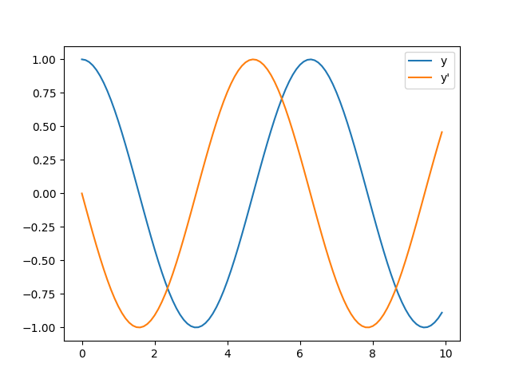

# 3.1 微积分工具包

## 3.1.1 数值积分的求解

计算积分其实我们很早的时候就学习过，可以利用梯形法解决这个问题。梯形法是一种数值积分方法，用于近似计算定积分的值。它通过连接函数在积分区间内各等分点上的值形成的线段（梯形）的面积来近似整个曲线下方的面积。

以下是一个使用Python实现梯形法计算函数定积分的案例。我们将计算函数 $f(x) = x^2$ 在区间 $[0, 1]$ 上的定积分。理论上，这个积分的值是 $\frac{1}{3}$。

```python
def trapezoidal_rule(f, a, b, n):
    h = (b - a) / n  # 每个梯形的宽度
    s = 0.5 * (f(a) + f(b))  # 第一个和最后一个梯形面积，每个只计算一半
    
    # 计算中间梯形的面积
    for i in range(1, n):
        x = a + i * h
        s += f(x)
    
    # 总面积是所有梯形面积的和
    s *= h
    
    return s

# 定义被积分的函数
def f(x):
    return x**2

# 计算定积分
a, b = 0, 1  # 积分区间
n = 100  # 分割的梯形数量，数量越多，结果越精确

# 调用梯形法函数
integral_approx = trapezoidal_rule(f, a, b, n)

print(f"使用梯形法（n={n}）计算的定积分近似值为: {integral_approx}")
print(f"理论值为: 1/3 = {1/3}")
```

在这个例子中，`trapezoidal_rule` 函数接收一个函数 `f`、积分区间的下限 `a` 和上限 `b`，以及将区间分割成的梯形数量 `n`。函数首先计算每个梯形的宽度 `h`，然后计算第一个和最后一个梯形（只计算一半）的面积，并累加中间所有梯形的面积。最后，将总面积乘以梯形的宽度 `h` 得到定积分的近似值。你可以通过改变 `n` 的值来观察近似值如何随着梯形数量的增加而接近理论值 $\frac{1}{3}$。

`scipy.integrate` 模块是 SciPy 库中用于数值积分的一个重要部分，它提供了多种数值积分求解的函数，能够处理从简单的一维积分到复杂的多重积分等问题。以下是一些常用的数值积分求解函数及其使用方法，并给出相应的例子。

`quad` 函数用于计算一维函数的定积分。其基本用法是 `scipy.integrate.quad(func, a, b, args=(), full_output=0, epsabs=1.49e-08, epsrel=1.49e-08, limit=50, points=None, weight=None, wvar=None, wopts=None, maxp1=50, limlst=50)`，其中 `func` 是被积函数，`a` 和 `b` 是积分的上下限，`args` 是传递给函数的额外参数（如果有的话）。

**例子**：计算函数 $f(x) = x^2$ 在区间 $[0, 1]$ 上的定积分。

```python
from scipy.integrate import quad
import numpy as np

def f(x):
    return x**2

result, error = quad(f, 0, 1)
print(f"Integral: {result}, Error: {error}")
```

`dblquad` 函数用于计算二维函数的二重积分。其基本形式是 `scipy.integrate.dblquad(func, a, b, gfun, hfun, args=(), epsabs=1.49e-08, epsrel=1.49e-08)`，其中 `func` 是被积函数（通常接受两个变量），`a` 和 `b` 是第一个积分变量的上下限，`gfun` 和 `hfun` 是第二个积分变量的上下限函数（这两个函数以第一个积分变量为自变量）。

**例子**：计算二重积分 $\int_{0}^{1} \int_{0}^{x} x y \, dy \, dx$。

```python
from scipy.integrate import dblquad

def f(y, x):
    return x * y

def g(x):
    return 0

def h(x):
    return x

result, error = dblquad(f, 0, 1, g, h)
print(f"Integral: {result}, Error: {error}")
```

`tplquad` 函数用于计算三维函数的三重积分。它的用法与 `dblquad` 类似，但增加了对第三个积分变量的处理。而`nquad` 函数提供了更一般的接口，用于计算任意维度的多重积分。它允许用户指定每个积分变量的上下限以及被积函数。


`trapz` 函数使用梯形法则来计算给定数据点的数值积分。它特别适用于对离散数据进行积分，如实验数据或数值解。

**例子**：计算由点集定义的函数在给定区间上的积分。

```python
from scipy.integrate import trapz
import numpy as np

# 假设的函数值和对应的x
# 假设的数据点  
x = np.linspace(0, 1, 100)  # 均匀分布的x值  
y = x**2  # 对应的函数值  
  
# 使用trapz计算数值积分  
result = trapz(y, x)  
print(f"Integral approximation: {result}")
```

在这个例子中，`trapz` 函数通过梯形法则计算了由 `x` 和 `y` 定义的函数在区间 `[0, 1]` 上的数值积分。这里，`x` 是积分变量的样本点，`y` 是对应的函数值。`trapz` 函数直接接受 `y` 数组和 `x` 数组作为输入，并返回积分的近似值。 

## 3.1.2 常微分方程的数值解

微分方程的数值解是什么样子的呢？虽然大多数微分方程没有解析解，但解析式也并不是唯一可以表示函数的形式。函数的表示还可以用列表法和作图法来表示，而微分方程的数值解也正是像列表一样针对自变量数组中的每一个取值给出相对精确的因变量值。

`scipy.integrate.odeint` 是 SciPy 库中用于求解常微分方程（ODE）初值问题的一个函数。它基于 FORTRAN 的 ODEPACK 库中的 LSODA 方法，能够处理刚性和非刚性系统。其基本用法如下：

```python
scipy.integrate.odeint(func, y0, t, args=(), Dfun=None, col_deriv=0, full_output=0, ...)
```

- **func**：导数函数，即 y 关于 t 的导数，形式为 `func(y, t, *args)`，其中 `y` 是函数值向量，`t` 是时间，`*args` 是传递给函数的额外参数。
- **y0**：初始条件，即 t=t0 时的 y 值。
- **t**：一个序列，表示求解函数值对应的时间点。序列的第一个元素对应于初始时间 t0，且时间序列必须是单调递增或单调递减的。
- **args**：一个元组，包含传递给 func 的额外参数。

**1. 一般的一阶常微分方程**

**例子**：求解 dy/dt = sin(t^2)，初始条件 y(0) = 1。

```python
from scipy.integrate import odeint
import numpy as np
import matplotlib.pyplot as plt

def dy_dt(y, t):
    return np.sin(t**2)

y0 = [1]
t = np.arange(0, 10, 0.1)
y = odeint(dy_dt, y0, t)

plt.plot(t, y)
plt.xlabel('t')
plt.ylabel('y')
plt.title('dy/dt = sin(t^2)')
plt.show()
```


**2. 常微分方程组**

**例子**：SEIR 模型（传染病模型），包含四个变量 S（易感者）、E（暴露者）、I（感染者）、R（康复者）。

$$
N \frac{\mathrm{d}s}{\mathrm{d}t} = -N \lambda si, \\[0.5em]
N \frac{\mathrm{d}e}{\mathrm{d}t} = N \lambda si - N \delta e, \\[0.5em]
N \frac{\mathrm{d}i}{\mathrm{d}t} = N \delta e - N \mu i, \\[0.5em]
N \frac{\mathrm{d}r}{\mathrm{d}t} = -N \mu i, \\[0.5em]
s(t) + e(t) + i(t) + r(t) = 1
$$

```python
def model(Y, t, N, beta0, days0, beta1, gamma, sigma):
    S, E, I, R = Y
    beta = beta0 if t < days0 else beta1
    dS = -beta * S * I / N
    dE = beta * S * I / N - sigma * E
    dI = sigma * E - gamma * I
    dR = gamma * I
    return [dS, dE, dI, dR]

N = 1000
beta0, beta1, gamma, sigma = 0.857, 0.304, 0.357, 0.312
days0 = 70
daysTotal = 365
T = np.arange(daysTotal)
N0 = [N - 1, 1, 0, 0]  # 初始条件

res = odeint(model, N0, T, args=(N, beta0, days0, beta1, gamma, sigma))

plt.plot(T, res[:, 0], label='S')
plt.plot(T, res[:, 1], label='E')
plt.plot(T, res[:, 2], label='I')
plt.plot(T, res[:, 3], label='R')
plt.legend()
plt.show()
```


**3. 二阶常微分方程**

对于二阶常微分方程，通常需要将其转化为两个一阶方程组成的方程组。

**例子**：求解 y'' + y = 0，初始条件 y(0) = 1, y'(0) = 0。

令 y1 = y, y2 = y'，则 y1' = y2, y2' = -y1。

```python
def second_order(y, t):
    y1, y2 = y
    return [y2, -y1]

y0 = [1, 0]  # 初始条件
t = np.arange(0, 10, 0.1)
y = odeint(second_order, y0, t)

plt.plot(t, y[:, 0], label='y')
plt.plot(t, y[:, 1], label='y\'')
plt.legend()
plt.show()
```



**4. 高阶常微分方程**

关于高阶常微分方程的解法，其基本原理与二阶微分方程相同，即将高阶方程转化为多个一阶微分方程组成的方程组。然而，随着方程阶数的增加，需要引入的变量也会增多，从而使得方程组变得更加复杂。

不过，为了完整性，我将给出一个三阶常微分方程转化为三个一阶微分方程的例子，并展示如何使用`scipy.integrate.odeint`来求解它。

**案例**：考虑三阶常微分方程：

$$ y''' + y'' + y' + y = 0 $$

初始条件为 $y(0) = 1, y'(0) = 0, y''(0) = 0$。

首先，我们定义三个新的变量：

$$ y_1 = y $$
$$ y_2 = y' $$
$$ y_3 = y'' $$

这样，原三阶方程就可以转化为以下三个一阶方程：

$$ y_1' = y_2 $$
$$ y_2' = y_3 $$
$$ y_3' = -y_1 - y_2 - y_3 $$

接下来，我们编写Python代码来求解这个方程组：

```python
from scipy.integrate import odeint
import numpy as np
import matplotlib.pyplot as plt

def third_order(y, t):
    y1, y2, y3 = y
    dy1 = y2
    dy2 = y3
    dy3 = -y1 - y2 - y3
    return [dy1, dy2, dy3]

# 初始条件
y0 = [1, 0, 0]

# 时间点
t = np.arange(0, 10, 0.1)

# 求解
y = odeint(third_order, y0, t)

# 绘图
plt.figure(figsize=(10, 6))

plt.subplot(3, 1, 1)
plt.plot(t, y[:, 0], label='y')
plt.title('y(t)')
plt.grid(True)

plt.subplot(3, 1, 2)
plt.plot(t, y[:, 1], label='y\'')
plt.title('y\'(t)')
plt.grid(True)

plt.subplot(3, 1, 3)
plt.plot(t, y[:, 2], label='y\'\'')
plt.title('y\'\'(t)')
plt.grid(True)

plt.tight_layout()
plt.show()
```


在这段代码中，我们首先定义了`third_order`函数，它接受当前的函数值向量`y`和时间`t`作为输入，并返回对应的导数向量。然后，我们设置了初始条件`y0`和时间点`t`，并使用`odeint`函数求解方程组。最后，我们使用Matplotlib库将求解结果绘制成图形，分别展示了$y(t)$、$y'(t)$和$y''(t)$随时间的变化情况。

**案例：洛伦兹系统（Lorenz System）**

洛伦兹系统是一个经典的混沌系统，由三个一阶微分方程组成：

$$ \frac{dx}{dt} = \sigma(y - x) $$
$$ \frac{dy}{dt} = x(\rho - z) - y $$
$$ \frac{dz}{dt} = xy - \beta z $$

其中，$\sigma$、$\rho$和$\beta$是系统的参数。

以下是使用`scipy.integrate.odeint`求解洛伦兹系统的Python代码：

```python
import numpy as np
from scipy.integrate import odeint
from mpl_toolkits.mplot3d import Axes3D
import matplotlib.pyplot as plt
def dmove(Point, t, sets):
    p, r, b = sets
    x, y, z = Point
    return np.array([p*(y-x), x*(r-z), x*y-b*z])
t = np.arange(0, 30, 0.001)
P1 = odeint(dmove, (0., 1., 0.), t, args=([10., 28., 3.],))
P2 = odeint(dmove, (0., 1.01, 0.), t, args=([10., 28., 3.],)) 
fig = plt.figure()
ax = Axes3D(fig)
ax.plot(P1[:,0], P1[:,1], P1[:,2])
ax.plot(P2[:,0], P2[:,1], P2[:,2])
plt.show()
```


在SciPy库中，除了`odeint`之外，`solve_ivp`和`solve_bvp`也是用于求解常微分方程（ODE）的重要函数，但它们各自适用于不同类型的初值问题（IVP）和边值问题（BVP）。

`solve_ivp`是SciPy中较新的一个函数，用于求解ODE的初值问题。它比`odeint`提供了更多的灵活性和功能，比如能够处理事件（events）和更复杂的积分方法。

**基本用法**：

```python
from scipy.integrate import solve_ivp

# 定义导数函数
def deriv(t, y):
    # 返回导数dy/dt
    return ...

# 初始条件
y0 = [...]

# 时间点
t_span = (t0, tf)  # 或使用数组形式指定多个时间点

# 调用solve_ivp
sol = solve_ivp(deriv, t_span, y0, method='RK45', t_eval=None, events=None, ...)

# sol.t 是计算的时间点
# sol.y 是对应的解
```

**例子**：求解简单的线性方程 dy/dt = -2y, y(0) = 1。

```python
from scipy.integrate import solve_ivp
import numpy as np
import matplotlib.pyplot as plt

def deriv(t, y):
    return -2 * y

y0 = [1]
t_span = (0, 5)
t_eval = np.linspace(0, 5, 100)

sol = solve_ivp(deriv, t_span, y0, t_eval=t_eval)

plt.plot(sol.t, sol.y[0])
plt.xlabel('t')
plt.ylabel('y')
plt.title('dy/dt = -2y')
plt.show()
```


`solve_bvp`用于求解ODE的边值问题（BVP），即给定在区间两端的函数值或导数，求解区间内的函数。

**基本用法**：

```python
from scipy.integrate import solve_bvp

# 定义导数函数
def fun(x, y):
    return np.vstack([...])  # 返回一个列向量，包含所有y_i的导数

# 定义边界条件
def bc(ya, yb):
    return np.array([...])  # 返回边界条件的残差

# 初始网格（可以自动细化）
x = np.linspace(a, b, num)

# 初始猜测解
y = np.zeros((num, len(y0)))  # y0是初始猜测的解向量
y[:, 0] = ...  # 填充初始猜测

# 调用solve_bvp
sol = solve_bvp(fun, bc, x, y, tol=1e-3, solver_options={'disp': True})

# sol.x 是优化后的网格
# sol.y 是对应的解
```

**注意**：`solve_bvp`需要较复杂的设置，特别是边界条件和初始猜测解，而且它返回的解`sol.y`是针对优化后的网格`sol.x`的。