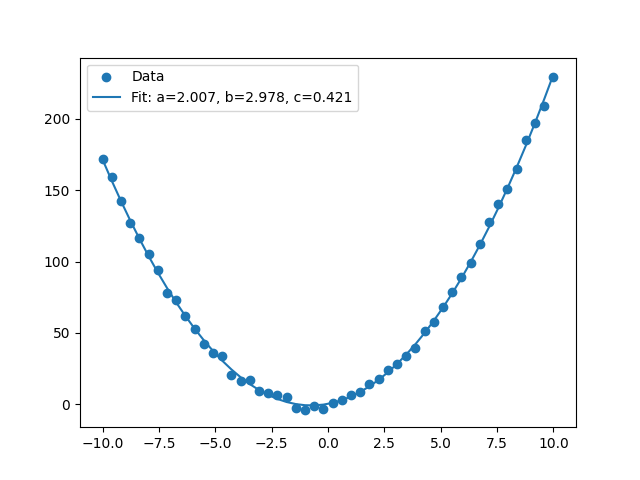
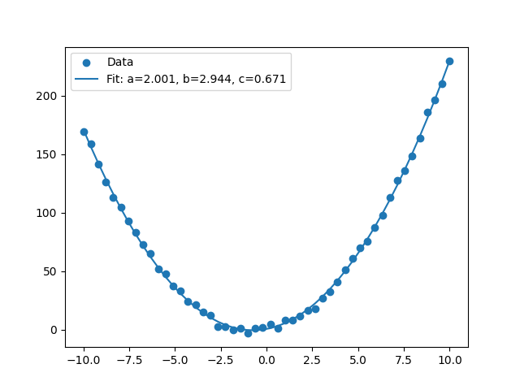

# 3.2 优化工具包

## 3.2.1 函数的零点与方程的解

`scipy.optimize` 模块包含了一些求解方程根的函数。其中的一些函数，如 `fsolve`、`root` 和 `brentq` 等，可以用来求解方程的根。

`fsolve` 函数使用最小二乘法（通常是 Levenberg-Marquardt 方法）来找到给定函数 `func(x)` 的根，其中 `x` 可以是标量或数组。它适用于求解非线性方程组。

**例子**：求解方程 $x^2 - 612 = 0$

```python
from scipy.optimize import fsolve

def func(x):
    return x**2 - 612

# 初始猜测
x0 = 10.0

# 求解
solution = fsolve(func, x0)

print(solution)  # 输出结果应该接近24.74（正根）
```

注意：由于 `fsolve` 可能依赖于初始猜测，它不一定总能找到所有的根或正确的根（尤其是当方程有多个根时）。

`root` 函数提供了更多的灵活性和算法选择来求解方程或方程组。它使用多种算法（如 'hybr', 'lm', 'broyden1', 'broyden2', 'anderson', 'linearmixing', 'diagbroyden', 'excitingmixing', 'krylov', 'df-sane'）来尝试找到函数的根。

**例子**：求解方程组

$$ \begin{cases} 
x^2 + y^2 - 4 = 0 \\
x - y = 1 
\end{cases} $$

```python
from scipy.optimize import root
import numpy as np

def func(vars):
    x, y = vars
    return [x**2 + y**2 - 4, x - y - 1]

# 初始猜测
x0 = [0, 0]

# 求解
solution = root(func, x0)

print(solution.x)  # 输出结果应该接近 [1.61803399, 0.61803399]（或其他满足方程的解）
```

`solution.x` 包含了方程的解，`solution.success` 表示是否成功找到解，`solution.message` 提供了关于求解过程的额外信息。

`brentq`, `brenth`, `ridder`, `bisect`等一些函数是专门用于求解一维方程根的函数，它们基于二分法或其改进版本。这些函数通常比 `fsolve` 或 `root` 在一维问题上更快、更稳定。

**例子**：使用 `brentq` 求解方程 $f(x) = x^2 - 2$ 在区间 [1, 2] 上的根。

```python
from scipy.optimize import brentq

def func(x):
    return x**2 - 2

# 求解
solution = brentq(func, 1, 2)

print(solution)  # 输出结果应该接近sqrt(2)
```

这些函数要求你提供一个包含根的区间，并且函数在该区间内必须是连续的，且在该区间的两端点上的函数值符号相反。

## 3.2.2 函数的极值优化

### 1. 无约束极值

`scipy.optimize.brent` 是 SciPy 库中用于求解单变量无约束优化问题的函数，它结合了牛顿法和二分法的优点，既能保证稳定性又能快速收敛，是求解一维搜索问题的首选方法之一。下面通过具体例子来介绍 `scipy.optimize.brent` 的用法。

**示例**

假设我们有一个目标函数 `f(x) = (x - 1)^2`，我们想要找到这个函数的最小值点。这个函数的最小值显然在 `x = 1` 处取得，但我们现在要通过 `scipy.optimize.brent` 来求解它。

```python
import numpy as np
from scipy.optimize import brent

# 定义目标函数
def f(x):
    return (x - 1)**2

# 使用brent函数求解最小值点
# brack参数指定了搜索算法的开始区间，这里我们选择一个包含最小值的区间
xmin = brent(f, brack=(0, 2))

# 输出结果
print("最小值点 x =", xmin)
print("函数在最小值点的值 =", f(xmin))
```

在这个例子中，`brent` 函数的第一个参数是目标函数 `f`，第二个参数 `brack` 是一个元组，指定了搜索算法的开始区间。`brent` 函数会在这个区间内寻找函数的最小值点，并返回该点的 `x` 值。在这个例子中，我们选择了区间 `(0, 2)`，它包含了函数的最小值点 `x = 1`。

**注意事项**

1. **区间选择**：在使用 `brent` 函数时，选择合适的搜索区间非常重要。如果区间不包含最小值点，`brent` 可能无法找到正确的最小值点。
2. **参数设置**：`brent` 函数还有其他可选参数，如 `tol`（容忍度，控制收敛精度）、`maxiter`（最大迭代次数）和 `full_output`（是否返回所有输出参数）等。这些参数可以根据需要进行设置。
3. **返回值**：默认情况下，`brent` 只返回最小值点的 `x` 值。如果设置了 `full_output=True`，则会返回所有输出参数，包括最小值点的 `x` 值、函数在最小值点的值、迭代次数和函数评估次数等。

`scipy.optimize.fmin` 是 SciPy 库中的一个优化函数，用于求解无约束多元函数的最小值。该函数通过迭代方法（如Nelder-Mead单纯形法）来寻找函数的最小值点。

- `func`：需要最小化的函数，形式为 `func(x, *args)`。
- `x0`：初始点，可以是一个列表或数组。
- `args`：传递给 `func` 的额外参数，即 `f(x, *args)`。
- `full_output`：是否返回额外的输出信息，默认为 `False`。当设置为 `True` 时，会返回更多关于优化过程的信息。
- `disp`：是否显示优化过程，默认为 `True`，表示在优化过程中会打印消息。
- `maxfun`：最大函数评估次数，默认为 1000。
- `retall`：是否返回所有迭代过程中的函数值，默认为 `False`。

下面通过具体例子来介绍 `scipy.optimize.fmin` 的用法。

**示例**

假设我们有一个二次函数 `f(x) = ax^2 + bx + c`，其中 `a = 1, b = 3, c = 2`，我们想要找到这个函数的最小值点。

```python
import numpy as np
from scipy.optimize import fmin

# 定义需要最小化的函数
def quadratic(x, a, b, c):
    return a * x**2 + b * x + c

# 设置初始点
x0 = np.array([1.0])  # 注意：对于一维问题，x0 也需要是数组形式

# 设置函数参数
a, b, c = 1, 3, 2

# 使用 fmin 函数求解最小值
result = fmin(quadratic, x0, args=(a, b, c), full_output=True, disp=True)

# 输出结果
print("最小值点:", result[0])
print("最小值:", result[1])
print("迭代次数:", result[2]['nit'])
print("函数调用次数:", result[2]['nfev'])
```

**注意事项**

- `scipy.optimize.fmin` 主要依赖于单纯形法，这种方法在处理高维问题时可能效率不高，且对于复杂函数的优化效果可能不如基于梯度的方法。
- 在使用 `fmin` 时，选择合适的初始点 `x0` 对优化结果有很大影响。不恰当的初始点可能导致算法陷入局部最优解或无法收敛。

### 2. 线性规划

`scipy.optimize.linprog` 是 SciPy 库中用于解决线性规划问题的函数。它能够处理带有线性等式和不等式约束的最小化问题。以下是 `linprog` 函数的基本用法和一个具体例子。

`linprog` 函数的基本调用格式如下：

```python
scipy.optimize.linprog(c, A_ub=A_ub, b_ub=b_ub, A_eq=A_eq, b_eq=b_eq, bounds=bounds)
```

考虑以下线性规划问题：

最小化目标函数 $ -29x_1 - 45x_2 $，受以下约束条件限制：

- $ x_1 - x_2 - 3x_3 \leq 5 $
- $ -2x_1 + 3x_2 + 7x_3 \leq -10 $
- $ 2x_1 + 8x_2 + x_3 = 60 $
- $ 4x_1 + 4x_2 + x_4 = 60 $
- 所有变量 $ x_1, x_2, x_3, x_4 $ 非负。

为了使用 `linprog` 解决这个问题，我们需要将目标函数转换为最小化形式（已给出），并设置适当的约束。以下是相应的 Python 代码：

```python
from scipy.optimize import linprog

# 目标函数系数，注意这里是最小化 -29x1 - 45x2，对于 x3 和 x4 的系数为 0
c = [-29, -45, 0, 0]

# 不等式约束的系数矩阵和常数项
A_ub = [[1, -1, -3, 0],
        [-2, 3, 7, -3]]
b_ub = [5, -10]

# 等式约束的系数矩阵和常数项
A_eq = [[2, 8, 1, 0],
        [4, 4, 0, 1]]
b_eq = [60, 60]

# 变量的界限，所有变量非负
bounds = [(0, None), (0, None), (0, None), (0, None)]

# 调用 linprog
result = linprog(c, A_ub=A_ub, b_ub=b_ub, A_eq=A_eq, b_eq=b_eq, bounds=bounds)

# 输出结果
print(result)
```

这段代码将调用 `linprog` 函数来求解上述线性规划问题，并输出求解结果，包括最优解、目标函数值等信息。

### 3. 指派问题

指派问题（Assignment Problem）是一种特殊的线性规划问题，它要求将一组任务分配给一组工人，每个工人只能分配到一个任务，每个任务也只能被一个工人完成，目标是使得总的分配成本（或时间、资源等）最小化。在数学上，这通常表示为一个成本矩阵，其中矩阵的每个元素表示特定工人完成特定任务的成本。

`scipy.optimize.linear_sum_assignment` 是 SciPy 库中用于解决指派问题的函数。它实现了匈牙利算法（也称为KM算法或Kuhn-Munkres算法）的变种，用于找到成本矩阵中的最小成本匹配。

```python
scipy.optimize.linear_sum_assignment(cost_matrix, maximize=False)
```

- `cost_matrix`：二维数组，表示成本矩阵。
- `maximize`：布尔值，如果为True，则函数会寻找最大权重的匹配，而不是默认的寻找最小权重的匹配。

函数返回两个一维数组，分别表示行索引和列索引的配对，使得对应的成本之和最小（或最大，如果`maximize=True`）。

假设有三个工人（A, B, C）和三个任务（1, 2, 3），我们需要确定哪个工人应该执行哪个任务，以最小化总成本。成本矩阵如下：

```
  1 2 3
A 4 1 3
B 2 0 5
C 3 2 2
```

在这个矩阵中，元素（i, j）表示工人i完成任务j的成本。

使用 `scipy.optimize.linear_sum_assignment` 来解决这个问题：

```python
from scipy.optimize import linear_sum_assignment

# 成本矩阵
cost_matrix = [[4, 1, 3],
               [2, 0, 5],
               [3, 2, 2]]

# 求解指派问题
row_ind, col_ind = linear_sum_assignment(cost_matrix)

# 输出结果
print("工人和任务的最优匹配（工人索引, 任务索引）:")
for i in range(len(row_ind)):
    print(f"工人 {chr(ord('A')+i)} -> 任务 {col_ind[i] + 1}")

# 计算最小总成本
min_cost = cost_matrix[row_ind, col_ind].sum()
print(f"最小总成本: {min_cost}")
```

输出可能是：

```
工人和任务的最优匹配（工人索引, 任务索引）:
工人 A -> 任务 2
工人 B -> 任务 1
工人 C -> 任务 3
最小总成本: 5
```

这表明，为了最小化总成本，应该将任务2分配给工人A，任务1分配给工人B，任务3分配给工人C，这样总成本就是5。

### 4. 非线性规划

`scipy.optimize.minimize` 是 SciPy 库中用于求解最小化问题的强大函数，它支持无约束优化、有约束优化以及全局优化等多种类型的问题。该函数的基本语法如下：

```python
scipy.optimize.minimize(fun, x0, args=(), method=None, jac=None, hess=None, hessp=None, bounds=None, constraints=(), tol=None, callback=None, options=None)
```

参数说明：

- **fun**：需要被最小化的目标函数。
- **x0**：优化变量的初始猜测值，是N维数组对象`ndarray`。
- **args**：可选，传递给目标函数及其导数的额外参数，以元组形式给出。
- **method**：可选，求解问题的方法，应该是预定义算法中的一种（如'Nelder-Mead', 'BFGS', 'L-BFGS-B'等）。如果不指定，将根据问题的性质（如是否有约束或界限）自动选择。
- **jac**：可选，目标函数的雅可比矩阵（一阶偏导）。对于某些方法（如CG, BFGS, Newton-CG等）是必需的或可以加速计算。
- **hess, hessp**：可选，目标函数的Hessian矩阵（二阶导数矩阵）或其乘积。仅适用于某些方法（如Newton-CG, dogleg等）。
- **bounds**：可选，变量的界限。以(min, max)对的形式定义每个优化变量的边界，仅适用于L-BFGS-B, TNC和SLSQP方法。
- **constraints**：可选，约束条件。可以是字典或列表的序列，每个约束包含`type`（'eq'表示等式约束，'ineq'表示不等式约束）、`fun`（定义约束的函数）和`jac`（约束条件的梯度函数，仅对SLSQP有效）等关键字。
- **tol**：可选，终止条件的容忍度，即优化算法的精度。
- **callback**：可选，每次迭代调用的回调函数，可以监控优化过程。
- **options**：可选，字典类型，用于设置优化器的其他选项，如最大迭代次数`maxiter`、是否打印收敛信息`disp`等。

当求解含有约束的极值优化问题时，`scipy.optimize.minimize` 通过设置`bounds`和`constraints`参数来处理这些约束。以下是一个具体的例子，说明如何在有约束条件下使用该函数。

假设我们需要最小化函数 `f(x, y) = (x-1)^2 + (y-2)^2`，同时满足约束条件 `x + 2y >= 1` 和 `x, y` 的取值范围都在 `[0, 2]` 之间。

首先，我们需要定义目标函数和约束条件：

```python
import numpy as np
from scipy.optimize import minimize

# 目标函数
def objective(x):
    return (x[0] - 1)**2 + (x[1] - 2)**2

# 约束条件
def constraint1(x):
    return x[0] + 2*x[1] - 1

# 定义约束条件为字典列表
con = ({'type': 'ineq', 'fun': constraint1})

# 变量的界限
bounds = [(0, 2), (0, 2)]

# 初始猜测值
x0 = [0, 0]

# 使用minimize求解
res = minimize(objective, x0, method='SLSQP', bounds=bounds, constraints=con)

# 打印结果
print(res.x)  # 最优解
print(res.fun)  # 最优解处的函数值
print(res.success)  # 是否成功找到解
print(res.message)  # 终止原因
```

在这个例子中，我们使用`SLSQP`方法求解带有不等式约束和变量界限的最小化问题。`bounds`参数定义了每个变量的取值范围，`constraints`参数定义了不等式约束条件。最终，`minimize`函数返回了包含优化结果的`OptimizeResult`对象，其中包括最优解`x`、最优解处的函数值`fun`、是否成功找到解的标志`success`以及终止原因的描述`message`。


## 3.2.3 曲线拟合

在Python的`scipy.optimize`模块中，`leastsq`和`curve_fit`是两个常用的函数，用于通过最小二乘法进行数据拟合。

`leastsq`函数是SciPy中用于执行最小二乘拟合的一个函数，它通过最小化误差平方和来找到最佳拟合参数。`leastsq`函数的基本形式为：

```python
scipy.optimize.leastsq(func, x0, args=(), Dfun=None, full_output=0, col_deriv=0, ftol=1.49012e-08, xtol=1.49012e-08, gtol=0.0, maxfev=0, epsfcn=None, factor=100, diag=None)
```

其中，`func`是计算误差的函数，`x0`是初始参数估计值，`args`是传递给`func`的其他参数（元组形式）。

**示例**：

假设我们有一组数据点，并希望用二次多项式`f(x) = ax^2 + bx + c`来拟合这些数据。

```python
import numpy as np
from scipy.optimize import leastsq
import matplotlib.pyplot as plt

# 定义模型函数
def model(x, a, b, c):
    return a * x**2 + b * x + c

# 定义误差函数
def residuals(params, x, y):
    a, b, c = params
    return y - model(x, a, b, c)

# 生成模拟数据
x = np.linspace(-10, 10, 50)
y = model(x, 2, 3, 1) + np.random.normal(0, 2, len(x))  # 添加噪声

# 初始参数估计
initial_params = [0, 0, 0]

# 执行拟合
params, flag = leastsq(residuals, initial_params, args=(x, y))

# 绘制结果
plt.scatter(x, y, label='Data')
plt.plot(x, model(x, *params), label='Fit: a=%5.3f, b=%5.3f, c=%5.3f' % tuple(params))
plt.legend()
plt.show()
```


`curve_fit`是SciPy中用于曲线拟合的另一个函数，它直接通过非线性最小二乘法来拟合数据。与`leastsq`相比，`curve_fit`的接口更加直观和易用。

**用法概述：**

`curve_fit`函数的基本形式为：

```python
scipy.optimize.curve_fit(f, xdata, ydata, p0=None, sigma=None, absolute_sigma=False, check_finite=True, bounds=(-inf, inf), method=None, jac=None, **kwargs)
```

其中，`f`是模型函数，`xdata`和`ydata`分别是自变量和因变量的数据点，`p0`是初始参数估计值。

**示例**：

继续使用上面的二次多项式拟合示例。

```python
import numpy as np
from scipy.optimize import curve_fit
import matplotlib.pyplot as plt

# 定义模型函数
def model(x, a, b, c):
    return a * x**2 + b * x + c

# 生成模拟数据
x = np.linspace(-10, 10, 50)
y = model(x, 2, 3, 1) + np.random.normal(0, 2, len(x))  # 添加噪声

# 初始参数估计
p0 = [0, 0, 0]

# 执行拟合
params, pcov = curve_fit(model, x, y, p0=p0)

# 绘制结果
plt.scatter(x, y, label='Data')
plt.plot(x, model(x, *params), label='Fit: a=%5.3f, b=%5.3f, c=%5.3f' % tuple(params))
plt.legend()
plt.show()
```


在上面的`curve_fit`示例中，我们首先定义了模型函数`model`，该函数接受自变量`x`和三个参数`a`、`b`、`c`，并返回根据二次多项式计算得到的`y`值。然后，我们生成了一组模拟数据，这些数据是通过在真实模型上添加随机噪声得到的。

接下来，我们设置了初始参数估计`p0`，这些参数是我们在开始拟合之前对模型参数的猜测。在这个例子中，我们简单地猜测所有参数都是0。

调用`curve_fit`函数时，我们传入了模型函数`model`、自变量数据`x`、因变量数据`y`以及初始参数估计`p0`。`curve_fit`函数会找到最佳拟合参数，这些参数使得模型函数与数据之间的误差平方和最小。

拟合完成后，`curve_fit`返回两个值：最佳拟合参数`params`和这些参数的协方差矩阵`pcov`（如果需要的话）。在这个例子中，我们只关心最佳拟合参数`params`，并使用它们来绘制拟合曲线。

最后，我们使用`matplotlib`库来绘制原始数据点和拟合曲线，并通过图例显示了拟合得到的参数值。这样，我们就可以直观地看到拟合的效果，并验证模型是否能够准确地描述数据。