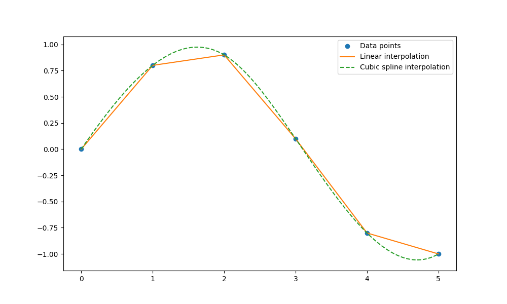
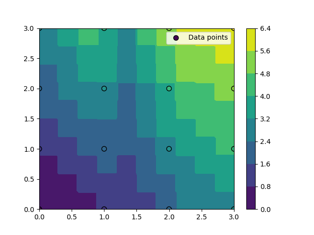

# 3.3 插值工具包

## 3.3.1 一维插值

`scipy.interpolate` 模块提供了多种一维和多维插值方法。在一维插值中，你通常想要根据一组已知的数据点（x 坐标和对应的 y 值）来估计或预测其他未知 x 坐标处的 y 值。以下是一些常用的一维插值方法的介绍，并通过示例来说明它们的使用。

**常用的一维插值方法**

1. **线性插值 (`interp1d` with `kind='linear'`)**： 这是最简单也是最常用的插值方法，它通过连接数据点之间的直线来估计未知点的值。

2. **多项式插值 (`interp1d` with `kind='polyint'` 或直接使用 `PPoly`/`BPoly`)**： 通过一个多项式来拟合数据点，然后使用该多项式来估计未知点的值。注意，`interp1d` 中 `kind='polyint'` 并不是一个直接的选项，这里指的是可以使用高阶多项式（如 `kind=3` 表示三次多项式）来插值，但通常建议使用较低阶多项式以避免龙格现象（Runge's phenomenon）。

3. **样条插值 (`interp1d` with `kind='cubic'` 或使用 `splrep`, `splev`)**： 使用分段多项式（通常是三次多项式）来插值，这些多项式在每个数据点之间的区间内是平滑的。

**示例：使用 `interp1d` 进行线性插值和样条插值**

```python
import numpy as np
import matplotlib.pyplot as plt
from scipy.interpolate import interp1d

# 定义数据点
x = np.array([0, 1, 2, 3, 4, 5])
y = np.array([0, 0.8, 0.9, 0.1, -0.8, -1])

# 使用线性插值
f_linear = interp1d(x, y, kind='linear')

# 使用三次样条插值
f_cubic = interp1d(x, y, kind='cubic')

# 生成新的x值以进行插值
x_new = np.linspace(0, 5, 400)

# 计算插值结果
y_linear = f_linear(x_new)
y_cubic = f_cubic(x_new)

# 绘制结果
plt.figure(figsize=(10, 6))
plt.plot(x, y, 'o', label='Data points')
plt.plot(x_new, y_linear, '-', label='Linear interpolation')
plt.plot(x_new, y_cubic, '--', label='Cubic spline interpolation')
plt.legend()
plt.show()
```


在这个例子中，我们首先定义了一组数据点 `x` 和 `y`，然后使用 `interp1d` 函数分别进行了线性插值和三次样条插值。通过生成一组新的 `x` 值 `x_new`，我们计算了在这些新 `x` 值处的插值结果 `y_linear` 和 `y_cubic`，并使用 Matplotlib 库将原始数据点和插值结果绘制出来。

从图中可以看出，线性插值通过直线连接数据点，而三次样条插值则提供了更平滑的曲线，尤其是在数据点之间的区域。这对于需要平滑过渡或避免过拟合的场合非常有用。


## 3.3.2 二维插值

`scipy.interpolate.interp2d` 是 `scipy.interpolate` 模块中的一个函数，用于对二维数据进行插值。这个函数接受一组二维数据点的 x 坐标、y 坐标以及对应的 z 值（即函数值），并返回一个插值函数对象。这个插值函数对象可以在新的 x 和 y 坐标上计算 z 的估计值。

下面是一个使用 `interp2d` 的具体例子：

```python
import numpy as np
import matplotlib.pyplot as plt
from scipy.interpolate import interp2d

# 定义已知数据点的 x 和 y 坐标
x = np.array([0, 1, 2, 3])
y = np.array([0, 1, 2, 3])

# 创建一个网格化的 x 和 y 坐标（这里为了简单起见，我们使用相同的 x 和 y 坐标，但通常它们会是不同的）
x, y = np.meshgrid(x, y)

# 定义这些坐标点对应的 z 值（这里我们创建一个简单的二维数组作为示例）
z = np.array([[0, 1, 2, 3],
              [1, 2, 3, 4],
              [2, 3, 4, 5],
              [3, 4, 5, 6]])

# 注意：由于 x 和 y 是通过 meshgrid 创建的，它们是二维数组。但是 interp2d 需要的是一维数组作为 x 和 y 的坐标。
# 因此，我们需要将 x 和 y 数组展平，并将 z 数组视为这些坐标点上的值。
x_flat = x.flatten()
y_flat = y.flatten()
z_flat = z.flatten()

# 使用 interp2d 创建插值函数对象
# kind 参数指定了插值方法，这里我们使用 'linear'（线性插值），但也可以尝试 'cubic'（三次插值）等
f = interp2d(x_flat, y_flat, z_flat, kind='linear')

# 现在我们想要在新的 x 和 y 坐标上进行插值
# 假设我们想要在一个更细的网格上进行插值
x_new = np.linspace(0, 3, 10)
y_new = np.linspace(0, 3, 10)
x_new, y_new = np.meshgrid(x_new, y_new)

# 注意：interp2d 需要的 x 和 y 是一维数组，因此我们需要将它们展平以匹配输入数据的形状
# 但由于我们是在整个网格上进行插值，我们可以直接使用 x_new.ravel() 和 y_new.ravel() 来获取一维数组
z_new = f(x_new.ravel(), y_new.ravel())

# 由于 z_new 是一维数组，我们需要将其重新塑形为与 x_new 和 y_new 相同的形状
z_new = z_new.reshape((100,100))
x_new = np.linspace(0, 3, 100)
y_new = np.linspace(0, 3, 100)
x_new, y_new = np.meshgrid(x_new, y_new)

# 绘制结果
plt.contourf(x_new, y_new, z_new, cmap='viridis')
plt.colorbar()
plt.scatter(x_flat, y_flat, c=z_flat, s=50, edgecolor='k', marker='o', label='Data points')
plt.legend()
plt.show()
```


