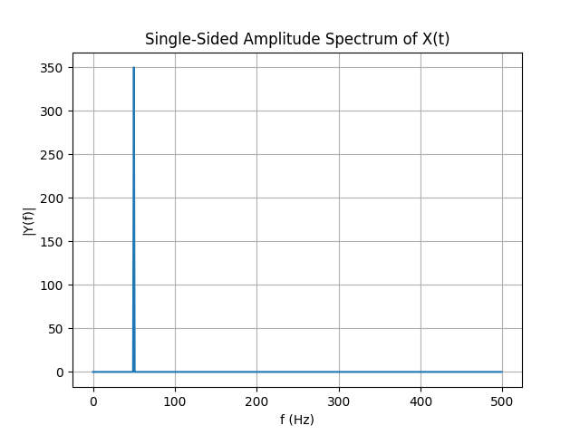
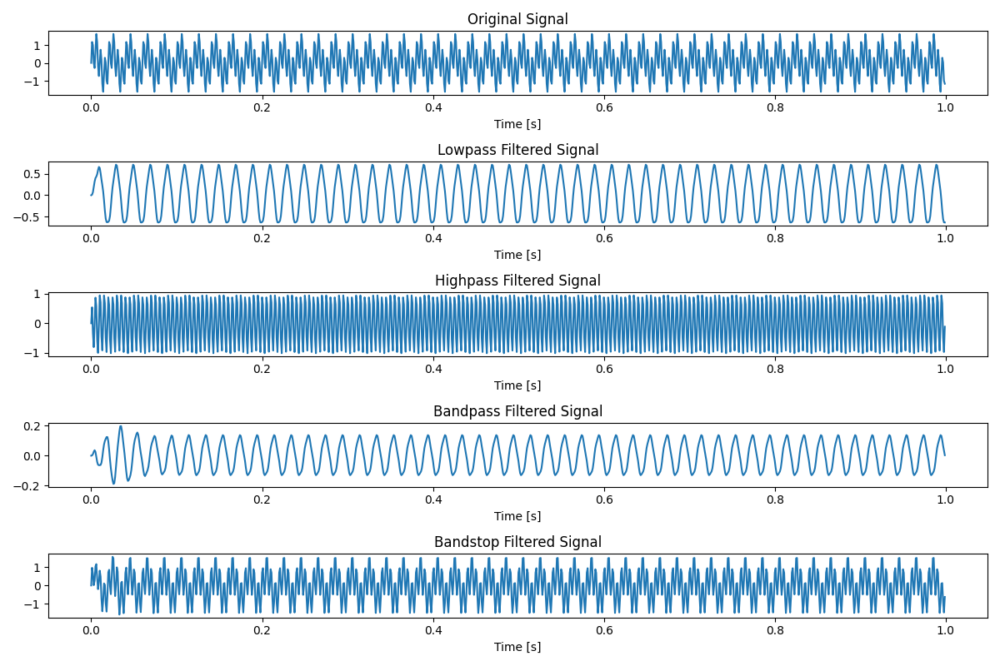

# 3.5 傅里叶变换工具包

## 3.5.1 快速傅里叶变换

快速傅里叶变换（FFT）是离散傅里叶变换（DFT）的一种高效算法，其核心在于通过递归或迭代的方式将DFT的计算复杂度从$O(N^2)$降低到$O(N \log N)$。

DFT的定义为：
$$ X[k] = \sum_{n=0}^{N-1} x[n] e^{-2\pi i \frac{kn}{N}} $$
其中，$x[n]$是时域信号，$X[k]$是对应的频域表示，$N$是信号的长度。

FFT通过分解信号为更小的部分，并利用旋转因子$W_N^{nk} = e^{-2\pi i \frac{nk}{N}}$的对称性和周期性来减少计算量。具体地，FFT算法如按时间抽取（DIT）可以表示为：

1. 将$x[n]$分为偶数序列$x_0[n]$和奇数序列$x_1[n]$。
2. 分别计算$X_0[k]$和$X_1[k]$，即$x_0[n]$和$x_1[n]$的DFT。
3. 利用蝶形运算合并结果，得到$X[k]$。

蝶形运算的公式可以简化为：
$$ X[k] = X_0[k] + W_N^k X_1[k] $$
$$ X[k+N/2] = X_0[k] - W_N^k X_1[k] $$

这里，$W_N^k$是旋转因子，$k$是当前迭代的频率索引，$N$是序列长度。每一级迭代都会将序列长度减半，并产生新的旋转因子，直到整个序列被完全处理。

在Python中，`scipy.fft`模块提供了快速傅里叶变换（FFT）的实现。以下是一个使用`scipy.fft.fft`函数进行快速傅里叶变换的示例代码。我们将对一个简单的离散时间信号进行FFT，并绘制其频谱。

你可以使用以下代码进行FFT并绘制频谱：

```python
import numpy as np
import matplotlib.pyplot as plt
from scipy.fft import fft, fftfreq

# 创建一个简单的信号：一个频率为50 Hz的正弦波，采样率为1000 Hz，持续1秒钟
fs = 1000  # 采样率
T = 1  # 信号时长
t = np.linspace(0, T, int(fs*T), endpoint=False)  # 时间向量
f = 50  # 信号频率
signal = 0.7*np.sin(2*np.pi*f*t)  # 生成信号

# 进行快速傅里叶变换
yf = fft(signal)

# 获取FFT的频率轴
xf = fftfreq(len(yf), 1/fs)

# 由于FFT结果是对称的，我们只取一半进行绘图
N = len(yf) // 2
yf = yf[:N]
xf = xf[:N]

# 绘制频谱的幅度（绝对值）
plt.figure()
plt.plot(xf, np.abs(yf))
plt.title('Single-Sided Amplitude Spectrum of X(t)')
plt.xlabel('f (Hz)')
plt.ylabel('|Y(f)|')
plt.grid()
plt.show()
```


在这个例子中：

1. 我们首先生成了一个简单的正弦波信号，其频率为50 Hz，采样率为1000 Hz，持续时间为1秒。
2. 使用`scipy.fft.fft`函数对该信号进行FFT变换。
3. 使用`scipy.fft.fftfreq`函数计算FFT的频率轴。
4. 由于FFT的结果是对称的（对于实数输入信号），我们只取了一半的频率轴和对应的FFT结果来绘制频谱。
5. 使用`matplotlib`绘制了信号的频谱图，其中横轴是频率（Hz），纵轴是FFT结果的幅度（绝对值）。

这样，你就可以看到信号在频域中的表示，即其在不同频率下的成分强度。在这个例子中，你应该能够看到一个明显的峰值在50 Hz处，这是原始信号中正弦波的频率。


## 3.5.2 简单的信号滤波

在Python中，使用`scipy.fft`和`scipy.signal`进行信号滤波通常涉及以下几个步骤：

1. 对信号进行快速傅里叶变换（FFT）。
2. 设计一个滤波器（例如低通、高通、带通或带阻滤波器），并在频域中应用它。
3. 对滤波后的频域信号进行逆快速傅里叶变换（IFFT）以回到时域。

这里我将用Python代码展示四种常见的滤波方式：低通滤波、高通滤波、带通滤波和带阻滤波。由于直接在频域手动操作（如之前的示例所示）通常不是最优选择，这里我将使用`scipy.signal`中提供的时域滤波函数。

以下是使用`scipy.signal`进行四种滤波方式的示例代码：

```python
import numpy as np
import matplotlib.pyplot as plt
from scipy.signal import butter, lfilter, freqz

# 创建一个测试信号：叠加了一个低频和一个高频正弦波
fs = 1000  # 采样率
T = 1  # 信号时长
t = np.linspace(0, T, int(fs*T), endpoint=False)
f1, f2 = 50, 200  # 两个正弦波的频率
signal = 0.7*np.sin(2*np.pi*f1*t) + np.sin(2*np.pi*f2*t)

# -------------------------- 低通滤波 --------------------------
# 设计低通滤波器
nyq = 0.5 * fs
cutoff = 80
low = cutoff / nyq
b_low, a_low = butter(N=3, Wn=low, btype='low', analog=False)
filtered_signal_low = lfilter(b_low, a_low, signal)

# -------------------------- 高通滤波 --------------------------
# 设计高通滤波器
high = 120 / nyq
b_high, a_high = butter(N=3, Wn=high, btype='high', analog=False)
filtered_signal_high = lfilter(b_high, a_high, signal)

# -------------------------- 带通滤波 --------------------------
# 设计带通滤波器
low_b = 60 / nyq
high_b = 100 / nyq
b_band, a_band = butter(N=3, Wn=[low_b, high_b], btype='band', analog=False)
filtered_signal_band = lfilter(b_band, a_band, signal)

# -------------------------- 带阻滤波 --------------------------
# 设计带阻滤波器
low_s = 150 / nyq
high_s = 180 / nyq
b_stop, a_stop = butter(N=3, Wn=[low_s, high_s], btype='bandstop', analog=False)
filtered_signal_stop = lfilter(b_stop, a_stop, signal)

# 绘制结果
plt.figure(figsize=(12, 8))

plt.subplot(5, 1, 1)
plt.plot(t, signal)
plt.title('Original Signal')
plt.xlabel('Time [s]')

plt.subplot(5, 1, 2)
plt.plot(t, filtered_signal_low)
plt.title('Lowpass Filtered Signal')
plt.xlabel('Time [s]')

plt.subplot(5, 1, 3)
plt.plot(t, filtered_signal_high)
plt.title('Highpass Filtered Signal')
plt.xlabel('Time [s]')

plt.subplot(5, 1, 4)
plt.plot(t, filtered_signal_band)
plt.title('Bandpass Filtered Signal')
plt.xlabel('Time [s]')

plt.subplot(5, 1, 5)
plt.plot(t, filtered_signal_stop)
plt.title('Bandstop Filtered Signal')
plt.xlabel('Time [s]')

plt.tight_layout()
plt.show()
```



在这个示例中，我使用了Butterworth滤波器（`scipy.signal.butter`函数），因为它在通带和阻带之间提供了平滑的过渡。然后，我使用`scipy.signal.lfilter`函数在时域中应用这些滤波器。每种滤波器的设计参数（如截止频率）都是根据测试信号的频率成分和所需的滤波效果来选择的。在实际应用中，你可能需要根据具体情况调整这些参数。此外，虽然我没有直接展示滤波器的频率响应图，但你可以使用`scipy.signal.freqz`函数来绘制它们，以便更好地了解滤波器的性能。