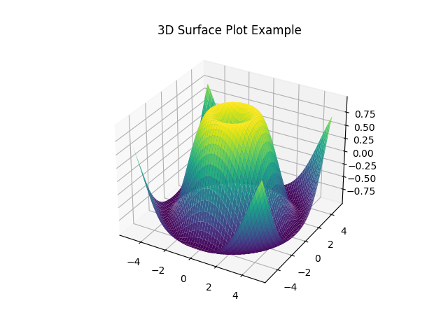

# 5.1 利用Matplotlib绘图

下面我将给出一些代码案例，展示如何使用`matplotlib.pyplot`库来绘制不同类型的图表，包括折线图、散点图、条形图、扇形图（饼图）、直方图和箱线图。

### 1. 折线图（plot功能）

```python
import matplotlib.pyplot as plt

# 数据
x = [1, 2, 3, 4, 5]
y = [1, 4, 9, 16, 25]

# 绘制折线图
plt.plot(x, y)

# 添加标题和坐标轴标签
plt.title('Simple Plot')
plt.xlabel('x axis')
plt.ylabel('y axis')

# 显示图表
plt.show()
```


### 2. 散点图（scatter功能）

```python
import matplotlib.pyplot as plt

# 数据
x = [1, 2, 3, 4, 5]
y = [2, 3, 5, 7, 11]

# 绘制散点图
plt.scatter(x, y)

# 添加标题
plt.title('Scatter Plot')

# 显示图表
plt.show()
```


### 3. 条形图（bar功能）

```python
import matplotlib.pyplot as plt

# 数据
categories = ['A', 'B', 'C', 'D']
values = [23, 45, 56, 78]

# 绘制条形图
plt.bar(categories, values)

# 添加标题和坐标轴标签
plt.title('Bar Chart')
plt.xlabel('Categories')
plt.ylabel('Values')

# 显示图表
plt.show()
```


### 4. 扇形图（饼图，pie功能）

```python
import matplotlib.pyplot as plt

# 数据
labels = 'Frogs', 'Hogs', 'Dogs', 'Logs'
sizes = [15, 30, 45, 10]

# 绘制扇形图
plt.pie(sizes, labels=labels, autopct='%1.1f%%', startangle=140)

# 添加标题
plt.title('Pie Chart')

# 显示图表
plt.axis('equal')  # Equal aspect ratio ensures that pie is drawn as a circle.
plt.show()
```


### 5. 直方图（hist功能）

```python
import matplotlib.pyplot as plt
import numpy as np

# 生成数据
mu, sigma = 0, 0.1  # 均值和标准差
data = np.random.normal(mu, sigma, 1000)

# 绘制直方图
plt.hist(data, bins=30, alpha=0.5, density=True)

# 添加标题和坐标轴标签
plt.title('Histogram')
plt.xlabel('Value')
plt.ylabel('Frequency')

# 显示图表
plt.show()
```


### 6. 箱线图（boxplot功能）

```python
import matplotlib.pyplot as plt
import numpy as np

# 生成数据
np.random.seed(10)
data = np.random.normal(0, 1, 200)
data = np.concatenate([data, [10]])  # 添加一个异常值

# 绘制箱线图
plt.boxplot(data)

# 添加标题
plt.title('Boxplot')

# 显示图表
plt.show()
```


### 7. 热力图（Heatmap）

```python
import matplotlib.pyplot as plt
import numpy as np

# 生成随机数据
data = np.random.rand(10, 10)

# 绘制热力图
plt.imshow(data, cmap='hot', interpolation='nearest')
plt.colorbar()  # 显示颜色条
plt.title('Heatmap Example')
plt.show()
```


### 8. 误差棒图（Errorbar Chart）

```python
import matplotlib.pyplot as plt
import numpy as np

# 数据
x = np.arange(0.1, 4, 0.5)
y = np.exp(-x)
yerr = 0.1 + 0.2 * np.sqrt(x)
xerr = 0.1 * np.ones_like(x)

# 绘制误差棒图
plt.errorbar(x, y, xerr=xerr, yerr=yerr, fmt='-o')
plt.title('Errorbar Chart Example')
plt.show()
```


### 9. 极坐标图（Polar Chart）

```python
import numpy as np
import matplotlib.pyplot as plt

# 数据
r = np.arange(0, 2, 0.01)
theta = 2 * np.pi * r

# 绘制极坐标图
plt.polar(theta, r)
plt.title('Polar Chart Example')
plt.show()
```


### 10. 三维曲面图（3D Surface Plot）

```python
from mpl_toolkits.mplot3d import Axes3D
import matplotlib.pyplot as plt
import numpy as np

# 数据
x = np.linspace(-5, 5, 100)
y = np.linspace(-5, 5, 100)
X, Y = np.meshgrid(x, y)
Z = np.sin(np.sqrt(X**2 + Y**2))

# 绘制三维曲面图
fig = plt.figure()
ax = fig.add_subplot(111, projection='3d')
ax.plot_surface(X, Y, Z, cmap='viridis')
plt.title('3D Surface Plot Example')
plt.show()
```



### 11. 三维曲线图

在`matplotlib`中，绘制三维曲线图通常涉及到使用`mpl_toolkits.mplot3d`模块中的`Axes3D`对象。这个对象提供了一个类似于二维绘图的接口，但允许你在三维空间中绘制图形。以下是一个绘制三维曲线图的示例代码：

```python
from mpl_toolkits.mplot3d import Axes3D
import matplotlib.pyplot as plt
import numpy as np

# 准备数据
t = np.linspace(0, 10, 1000)
x = np.sin(t)
y = np.cos(t)
z = t  # 或者你可以使用其他关于t的函数来计算z值

# 创建一个新的figure和一个3D的axes
fig = plt.figure()
ax = fig.add_subplot(111, projection='3d')

# 绘制三维曲线
ax.plot(x, y, z, label='3D Curve')

# 添加图例
ax.legend()

# 设置坐标轴标签
ax.set_xlabel('X Label')
ax.set_ylabel('Y Label')
ax.set_zlabel('Z Label')

# 设置标题
ax.set_title('3D Curve Example')

# 显示图形
plt.show()
```


### 12. 等高线图（Contour Plot）

```python
import matplotlib.pyplot as plt
import numpy as np

# 数据
N = 100
x = np.linspace(-3.0, 3.0, N)
y = np.linspace(-2.0, 2.0, N)
X, Y = np.meshgrid(x, y)
Z = np.sin(np.sqrt(X**2 + Y**2))

# 绘制等高线图
plt.contour(X, Y, Z, colors='k')
plt.contourf(X, Y, Z, cmap='viridis')
plt.colorbar()
plt.title('Contour Plot Example')
plt.show()
```

