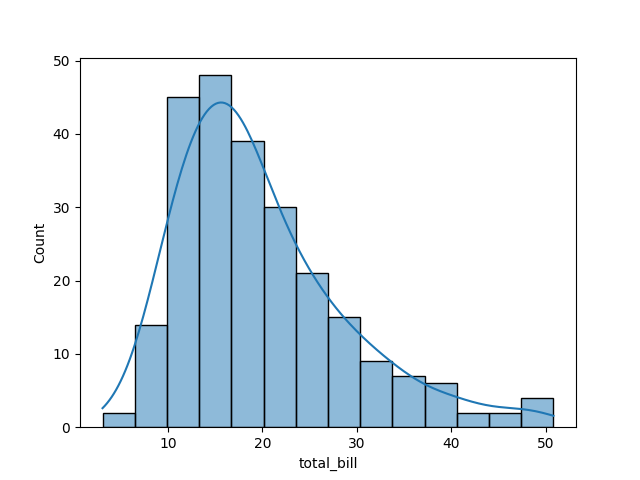

# 5.3 利用seaborn进行美化

## 5.3.1 利用seaborn调整布局与排版

在使用Seaborn进行数据可视化时，调整和优化布局排版是一个重要的环节，以确保图表既美观又易于理解。Seaborn是基于matplotlib的高级绘图库，它提供了许多内置的函数和样式选项来简化绘图过程，并自动处理一些布局和排版问题。然而，对于更复杂的布局需求，你可能需要结合使用Seaborn和matplotlib的功能。

以下是一些利用Seaborn和matplotlib调整优化布局排版的方法：

### 1. 使用Seaborn的内置样式

Seaborn提供了多种内置样式（如`darkgrid`、`whitegrid`、`dark`、`white`、`ticks`等），这些样式不仅改变了图表的背景色和网格线，还可以在一定程度上影响图表的布局和可读性。

```python
import seaborn as sns
import matplotlib.pyplot as plt

sns.set_style("darkgrid")  # 设置样式
sns.lineplot(x="timepoint", y="signal", hue="subject", data=df)
plt.show()
```

### 2. 调整子图布局

当需要在一个窗口中绘制多个图表时，可以使用`plt.subplots()`（matplotlib函数）来创建子图网格，并使用Seaborn的绘图函数在每个子图上绘图。

```python
fig, axes = plt.subplots(nrows=2, ncols=2, figsize=(10, 8))
sns.lineplot(x="timepoint", y="signal", data=df, ax=axes[0, 0])
sns.barplot(x="category", y="value", data=df2, ax=axes[0, 1])
sns.scatterplot(x="x", y="y", hue="category", data=df3, ax=axes[1, 0])
sns.histplot(data=df4["values"], ax=axes[1, 1])
plt.tight_layout()  # 自动调整子图参数, 使之填充整个图像区域
plt.show()
```

### 3. 使用`plt.tight_layout()`和`plt.subplots_adjust()`

`plt.tight_layout()`会自动调整子图参数，使之填充整个图像区域，并尽量减少子图之间的重叠。如果`tight_layout()`不能满足需求，可以使用`plt.subplots_adjust()`来手动调整子图之间的间距和边界。

### 4. 自定义图例、标题和轴标签

通过`plt.title()`, `plt.xlabel()`, `plt.ylabel()`, 和`plt.legend()`（或在Seaborn绘图函数中直接使用这些参数）来自定义图表的标题、轴标签和图例。这有助于增强图表的可读性和解释性。

### 5. 利用FacetGrid和PairGrid进行复杂布局

对于更复杂的数据布局，Seaborn提供了`FacetGrid`和`PairGrid`类，它们允许你以网格形式绘制多个相关的图表，并自动处理布局和排版。

```python
g = sns.FacetGrid(df, col="category", hue="subject", col_wrap=4)
g.map(sns.lineplot, "timepoint", "signal")
g.add_legend()
plt.show()
```

在这个例子中，`FacetGrid`根据`category`列的值将数据集分割成多个子图，并为每个子图绘制了`timepoint`和`signal`之间的线条图。

综上所述，通过结合使用Seaborn的内置样式、matplotlib的布局控制函数（如`plt.subplots()`、`plt.tight_layout()`、`plt.subplots_adjust()`）以及Seaborn的`FacetGrid`和`PairGrid`类，你可以灵活地调整和优化你的数据可视化布局的排版。

## 5.3.2 seaborn版本的一些图像

当然可以。下面我将通过Python代码示例，使用Seaborn和Matplotlib库来绘制您提到的各种图像。请注意，桑基图（Sankey diagram）通常不是由Seaborn直接提供的，但我们可以使用`matplotlib.sankey`来绘制。对于雷达图（也称为星形图或蜘蛛图），我们可以使用Matplotlib的功能来实现。

### 1. 频率分布直方图

```python
import seaborn as sns
import matplotlib.pyplot as plt

# 使用seaborn的tips数据集
tips = sns.load_dataset("tips")
sns.histplot(tips, x="total_bill", kde=True)
plt.show()
```



### 2. 概率密度曲线

概率密度曲线通常与直方图一起绘制，但这里单独展示。

```python
sns.kdeplot(tips["total_bill"], shade=True)
plt.show()
```


### 3. 箱线图

```python
sns.boxplot(x="day", y="total_bill", data=tips)
plt.show()
```


### 4. 提琴图

```python
sns.violinplot(x="day", y="total_bill", data=tips)
plt.show()
```


### 5. 热力图

```python
# 创建一个简单的数据集
flights = sns.load_dataset("flights")
flights = flights.pivot("month", "year", "passengers")
sns.heatmap(flights, annot=True, fmt="d")
plt.show()
```


### 6. Pairplot

```python
sns.pairplot(tips, hue="day")
plt.show()
```


