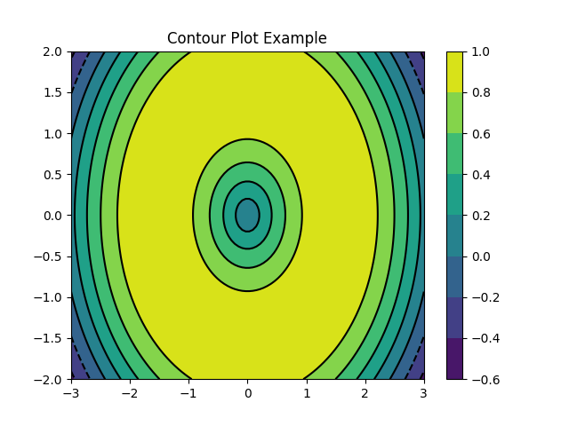

# 5. Matplotlib及其基本使用

数据可视化在科学计算中也有着重要的应用。如何将你的计算结果清晰地用图表展示出来呢？可以使用Matplotlib。这是Python中绘制图表的重要工具，在这一章当中，我们会使用Matplotlib和seaborn进行数据可视化的工作，讲解各种图表是怎么制作的。本章内容包括：

- [5.1 利用matplotlib绘图](./5.1-利用matplotlib绘图.md)
- [5.2 图窗，布局与排版](./5.2-图窗，布局与排版.md)
- [5.3 利用seaborn进行美化](./5.3-利用seaborn进行美化.md)

# 5.1 利用Matplotlib绘图

下面我将给出一些代码案例，展示如何使用`matplotlib.pyplot`库来绘制不同类型的图表，包括折线图、散点图、条形图、扇形图（饼图）、直方图和箱线图。

### 1. 折线图（plot功能）

```python
import matplotlib.pyplot as plt

# 数据
x = [1, 2, 3, 4, 5]
y = [1, 4, 9, 16, 25]

# 绘制折线图
plt.plot(x, y)

# 添加标题和坐标轴标签
plt.title('Simple Plot')
plt.xlabel('x axis')
plt.ylabel('y axis')

# 显示图表
plt.show()
```


### 2. 散点图（scatter功能）

```python
import matplotlib.pyplot as plt

# 数据
x = [1, 2, 3, 4, 5]
y = [2, 3, 5, 7, 11]

# 绘制散点图
plt.scatter(x, y)

# 添加标题
plt.title('Scatter Plot')

# 显示图表
plt.show()
```


### 3. 条形图（bar功能）

```python
import matplotlib.pyplot as plt

# 数据
categories = ['A', 'B', 'C', 'D']
values = [23, 45, 56, 78]

# 绘制条形图
plt.bar(categories, values)

# 添加标题和坐标轴标签
plt.title('Bar Chart')
plt.xlabel('Categories')
plt.ylabel('Values')

# 显示图表
plt.show()
```


### 4. 扇形图（饼图，pie功能）

```python
import matplotlib.pyplot as plt

# 数据
labels = 'Frogs', 'Hogs', 'Dogs', 'Logs'
sizes = [15, 30, 45, 10]

# 绘制扇形图
plt.pie(sizes, labels=labels, autopct='%1.1f%%', startangle=140)

# 添加标题
plt.title('Pie Chart')

# 显示图表
plt.axis('equal')  # Equal aspect ratio ensures that pie is drawn as a circle.
plt.show()
```


### 5. 直方图（hist功能）

```python
import matplotlib.pyplot as plt
import numpy as np

# 生成数据
mu, sigma = 0, 0.1  # 均值和标准差
data = np.random.normal(mu, sigma, 1000)

# 绘制直方图
plt.hist(data, bins=30, alpha=0.5, density=True)

# 添加标题和坐标轴标签
plt.title('Histogram')
plt.xlabel('Value')
plt.ylabel('Frequency')

# 显示图表
plt.show()
```


### 6. 箱线图（boxplot功能）

```python
import matplotlib.pyplot as plt
import numpy as np

# 生成数据
np.random.seed(10)
data = np.random.normal(0, 1, 200)
data = np.concatenate([data, [10]])  # 添加一个异常值

# 绘制箱线图
plt.boxplot(data)

# 添加标题
plt.title('Boxplot')

# 显示图表
plt.show()
```


### 7. 热力图（Heatmap）

```python
import matplotlib.pyplot as plt
import numpy as np

# 生成随机数据
data = np.random.rand(10, 10)

# 绘制热力图
plt.imshow(data, cmap='hot', interpolation='nearest')
plt.colorbar()  # 显示颜色条
plt.title('Heatmap Example')
plt.show()
```


### 8. 误差棒图（Errorbar Chart）

```python
import matplotlib.pyplot as plt
import numpy as np

# 数据
x = np.arange(0.1, 4, 0.5)
y = np.exp(-x)
yerr = 0.1 + 0.2 * np.sqrt(x)
xerr = 0.1 * np.ones_like(x)

# 绘制误差棒图
plt.errorbar(x, y, xerr=xerr, yerr=yerr, fmt='-o')
plt.title('Errorbar Chart Example')
plt.show()
```


### 9. 极坐标图（Polar Chart）

```python
import numpy as np
import matplotlib.pyplot as plt

# 数据
r = np.arange(0, 2, 0.01)
theta = 2 * np.pi * r

# 绘制极坐标图
plt.polar(theta, r)
plt.title('Polar Chart Example')
plt.show()

```


### 10. 三维曲面图（3D Surface Plot）

```python
from mpl_toolkits.mplot3d import Axes3D
import matplotlib.pyplot as plt
import numpy as np

# 数据
x = np.linspace(-5, 5, 100)
y = np.linspace(-5, 5, 100)
X, Y = np.meshgrid(x, y)
Z = np.sin(np.sqrt(X**2 + Y**2))

# 绘制三维曲面图
fig = plt.figure()
ax = fig.add_subplot(111, projection='3d')
ax.plot_surface(X, Y, Z, cmap='viridis')
plt.title('3D Surface Plot Example')
plt.show()

```


### 11. 三维曲线图

在`matplotlib`中，绘制三维曲线图通常涉及到使用`mpl_toolkits.mplot3d`模块中的`Axes3D`对象。这个对象提供了一个类似于二维绘图的接口，但允许你在三维空间中绘制图形。以下是一个绘制三维曲线图的示例代码：

```python
from mpl_toolkits.mplot3d import Axes3D
import matplotlib.pyplot as plt
import numpy as np

# 准备数据
t = np.linspace(0, 10, 1000)
x = np.sin(t)
y = np.cos(t)
z = t  # 或者你可以使用其他关于t的函数来计算z值

# 创建一个新的figure和一个3D的axes
fig = plt.figure()
ax = fig.add_subplot(111, projection='3d')

# 绘制三维曲线
ax.plot(x, y, z, label='3D Curve')

# 添加图例
ax.legend()

# 设置坐标轴标签
ax.set_xlabel('X Label')
ax.set_ylabel('Y Label')
ax.set_zlabel('Z Label')

# 设置标题
ax.set_title('3D Curve Example')

# 显示图形
plt.show()

```


### 12. 等高线图（Contour Plot）

```python
import matplotlib.pyplot as plt
import numpy as np

# 数据
N = 100
x = np.linspace(-3.0, 3.0, N)
y = np.linspace(-2.0, 2.0, N)
X, Y = np.meshgrid(x, y)
Z = np.sin(np.sqrt(X**2 + Y**2))

# 绘制等高线图
plt.contour(X, Y, Z, colors='k')
plt.contourf(X, Y, Z, cmap='viridis')
plt.colorbar()
plt.title('Contour Plot Example')
plt.show()

```



# 5.2 图窗，布局与排版

## 5.2.1 图窗、子图与分辨率

在`matplotlib.pyplot`中，你可以通过多种方式设置图窗（figure）、子图（subplots）、分辨率（DPI，即每英寸点数）以及排版松紧程度（通过调整子图间距等）。以下是一些基本的方法：

### 1. 设置图窗（Figure）

- **创建图窗**：使用`plt.figure()`函数可以创建一个新的图窗。
- **设置分辨率**：在`plt.figure()`函数中，可以通过`dpi`参数设置分辨率。

```python
import matplotlib.pyplot as plt

# 创建一个分辨率为100 DPI的图窗
plt.figure(dpi=100)

# 绘制一些内容...
plt.plot([1, 2, 3], [4, 3, 2])
plt.show()
```

### 2. 设置子图（Subplots）

- **创建子图**：使用`plt.subplots()`函数可以创建一个包含多个子图的图窗。
- **调整子图间距**：通过`plt.subplots_adjust()`函数可以调整子图之间的间距以及子图与图窗边界之间的间距。

```python
import matplotlib.pyplot as plt

# 创建一个包含2x2子图的图窗
fig, axs = plt.subplots(2, 2)

# 绘制一些内容...
for ax in axs.flat:
    ax.plot([1, 2], [2, 1])

# 调整子图间距
plt.subplots_adjust(left=0.1, right=0.9, top=0.9, bottom=0.1, hspace=0.4, wspace=0.4)

plt.show()
```

### 3. 排版松紧程度

排版松紧程度通常指的是子图之间的间距以及子图与图窗边界之间的间距。这可以通过`plt.subplots_adjust()`函数进行调整，如上例所示。

- `left`, `right`, `bottom`, `top` 参数分别控制图窗边缘与子图边缘之间的间距（以图窗宽度或高度的百分比表示）。
- `hspace` 和 `wspace` 参数分别控制子图之间的垂直和水平间距（以子图宽度或高度的百分比表示）。

### 4. 其他设置

- **设置图窗大小**：在`plt.figure()`中，还可以通过`figsize`参数（元组，表示宽度和高度，单位为英寸）来直接设置图窗的大小。
- **保存图像**：使用`plt.savefig()`函数可以将图形保存到文件中，并在此函数中设置分辨率（`dpi`参数）。

```python
# 设置图窗大小并保存图像
plt.figure(figsize=(8, 6), dpi=100)
# 绘制内容...
plt.plot([1, 2, 3], [4, 3, 2])
plt.savefig('my_plot.png')  # 保存图像
plt.show()
```

通过组合使用这些函数和参数，你可以灵活地控制`matplotlib`生成的图形的外观和布局。

## 5.2.2 字体、字号与布局

在`matplotlib.pyplot`中，你可以通过多种方式来自定义图表的各个方面，包括字体、字号、坐标轴、坐标刻度、坐标范围、网格以及图例（legend）。以下是一些基本的方法来设置这些属性：

### 1. 设置字体和字号

字体和字号可以通过`rcParams`（全局设置）或在绘图函数中使用`fontdict`参数来设置。但更常见的是使用`rcParams`进行全局设置。

```python
import matplotlib.pyplot as plt
import matplotlib as mpl

# 设置全局字体和字号
mpl.rcParams['font.family'] = 'sans-serif'  # 设置字体为sans-serif
mpl.rcParams['font.sans-serif'] = ['Arial']  # 在Windows上可能需要指定具体的字体名称
mpl.rcParams['font.size'] = 12  # 设置全局字号

# 绘制图形
plt.plot([1, 2, 3], [4, 3, 2])
plt.title('My Plot')
plt.xlabel('X Axis')
plt.ylabel('Y Axis')
plt.show()
```

### 2. 设置坐标轴

坐标轴可以通过`ax.set_xlabel()`, `ax.set_ylabel()`, `ax.set_xticks()`, `ax.set_yticks()`等方法来设置。

```python
plt.plot([1, 2, 3], [4, 3, 2])
plt.xlabel('X Axis Label', fontsize=14)  # 设置X轴标签和字号
plt.ylabel('Y Axis Label', fontsize=14)  # 设置Y轴标签和字号
plt.xticks(fontsize=12)  # 设置X轴刻度字号
plt.yticks(fontsize=12)  # 设置Y轴刻度字号
plt.show()
```

### 3. 设置坐标范围和刻度

坐标范围和刻度可以通过`plt.xlim()`, `plt.ylim()`, `plt.xticks()`, `plt.yticks()`等方法来设置。

```python
plt.plot([1, 2, 3], [4, 3, 2])
plt.xlim(0, 4)  # 设置X轴范围
plt.ylim(2, 5)  # 设置Y轴范围
plt.xticks([1, 2, 3])  # 设置X轴刻度
plt.yticks([3, 4])  # 设置Y轴刻度
plt.show()
```

### 4. 设置网格

网格可以通过`plt.grid()`方法开启和自定义。

```python
plt.plot([1, 2, 3], [4, 3, 2])
plt.grid(True)  # 开启网格
plt.grid(color='gray', linestyle='--', linewidth=0.5)  # 自定义网格样式
plt.show()
```

### 5. 设置图例（Legend）

图例可以通过在绘图函数中使用`label`参数，并在最后调用`plt.legend()`来添加。

```python
plt.plot([1, 2, 3], [4, 3, 2], label='Line 1')
plt.plot([1, 2, 3], [2, 3, 4], label='Line 2')
plt.legend()  # 添加图例
plt.show()
```

你还可以使用`plt.legend(loc='...')`来指定图例的位置，其中`'...'`可以是`'upper right'`, `'lower left'`, `'best'`等。

通过组合使用这些方法，你可以灵活地自定义matplotlib生成的图表的各个方面。

## 5.2.3 颜色、线宽、线型、点形状

在`matplotlib.pyplot`中，你可以通过不同的参数来控制绘图的颜色、线宽、线型以及点形状。以下是一些基本的设置方法：

### 1. 颜色（Color）

颜色可以通过多种方式指定，包括使用颜色的名称（如`'red'`、`'blue'`）、十六进制颜色代码（如`'#FF0000'`表示红色）、RGB或RGBA元组（如`(1.0, 0.0, 0.0)`表示红色，加上透明度则为`(1.0, 0.0, 0.0, 0.5)`）。

```python
import matplotlib.pyplot as plt

plt.plot([1, 2, 3], [4, 3, 2], color='red')  # 使用颜色名称
plt.plot([1, 2, 3], [3, 2, 1], color='#00FF00')  # 使用十六进制颜色代码
plt.show()

```

### 2. 线宽（Line Width）

线宽可以通过`linewidth`或简写为`lw`参数来控制。

```python
plt.plot([1, 2, 3], [4, 3, 2], color='blue', linewidth=2)  # 设置线宽为2
plt.show()

```

### 3. 线型（Line Style）

线型可以通过`linestyle`或简写为`ls`参数来控制，其值可以是实线（`'-'`）、虚线（`'--'`）、点划线（`'-.'`）、点线（`':'`）等。

```python
plt.plot([1, 2, 3], [4, 3, 2], linestyle='--')  # 虚线
plt.show()

```

### 4. 点形状（Marker Style）

当你想要在数据点上显示标记时，可以通过`marker`参数来指定点形状。点形状可以是各种预定义的形状，如`'o'`（圆圈）、`'.'`（点）、`','`（像素点）、`'^'`（上三角）等。

```python
plt.plot([1, 2, 3], [4, 3, 2], marker='o')  # 圆圈标记
plt.show()

```

你还可以结合使用颜色、线宽、线型和点形状来创建复杂的图表。

```python
plt.plot([1, 2, 3], [4, 3, 2], color='green', linewidth=2, linestyle='--', marker='s', markersize=10)
plt.show()

```

在这个例子中，我们设置了颜色为绿色、线宽为2、线型为虚线、点形状为正方形，并调整了标记的大小。

**注意事项**

- 当使用`marker`参数时，你还可以使用`markersize`（或简写为`ms`）参数来调整标记的大小。
- 默认情况下，如果同时指定了`linestyle`和`marker`，则两者都会显示。如果你只想显示标记而不显示线条，可以将`linestyle`设置为`''`（空字符串）或`'None'`。
- 类似地，如果你只想显示线条而不显示标记，可以省略`marker`参数或将其设置为`None`（尽管这通常是默认行为，除非在全局设置中更改了默认行为）。

# 5.3 利用seaborn进行美化

## 5.3.1 利用seaborn调整布局与排版

在使用Seaborn进行数据可视化时，调整和优化布局排版是一个重要的环节，以确保图表既美观又易于理解。Seaborn是基于matplotlib的高级绘图库，它提供了许多内置的函数和样式选项来简化绘图过程，并自动处理一些布局和排版问题。然而，对于更复杂的布局需求，你可能需要结合使用Seaborn和matplotlib的功能。

以下是一些利用Seaborn和matplotlib调整优化布局排版的方法：

### 1. 使用Seaborn的内置样式

Seaborn提供了多种内置样式（如`darkgrid`、`whitegrid`、`dark`、`white`、`ticks`等），这些样式不仅改变了图表的背景色和网格线，还可以在一定程度上影响图表的布局和可读性。

```python
import seaborn as sns
import matplotlib.pyplot as plt

sns.set_style("darkgrid")  # 设置样式
sns.lineplot(x="timepoint", y="signal", hue="subject", data=df)
plt.show()
```

### 2. 调整子图布局

当需要在一个窗口中绘制多个图表时，可以使用`plt.subplots()`（matplotlib函数）来创建子图网格，并使用Seaborn的绘图函数在每个子图上绘图。

```python
fig, axes = plt.subplots(nrows=2, ncols=2, figsize=(10, 8))
sns.lineplot(x="timepoint", y="signal", data=df, ax=axes[0, 0])
sns.barplot(x="category", y="value", data=df2, ax=axes[0, 1])
sns.scatterplot(x="x", y="y", hue="category", data=df3, ax=axes[1, 0])
sns.histplot(data=df4["values"], ax=axes[1, 1])
plt.tight_layout()  # 自动调整子图参数, 使之填充整个图像区域
plt.show()
```

### 3. 使用`plt.tight_layout()`和`plt.subplots_adjust()`

`plt.tight_layout()`会自动调整子图参数，使之填充整个图像区域，并尽量减少子图之间的重叠。如果`tight_layout()`不能满足需求，可以使用`plt.subplots_adjust()`来手动调整子图之间的间距和边界。

### 4. 自定义图例、标题和轴标签

通过`plt.title()`, `plt.xlabel()`, `plt.ylabel()`, 和`plt.legend()`（或在Seaborn绘图函数中直接使用这些参数）来自定义图表的标题、轴标签和图例。这有助于增强图表的可读性和解释性。

### 5. 利用FacetGrid和PairGrid进行复杂布局

对于更复杂的数据布局，Seaborn提供了`FacetGrid`和`PairGrid`类，它们允许你以网格形式绘制多个相关的图表，并自动处理布局和排版。

```python
g = sns.FacetGrid(df, col="category", hue="subject", col_wrap=4)
g.map(sns.lineplot, "timepoint", "signal")
g.add_legend()
plt.show()
```

在这个例子中，`FacetGrid`根据`category`列的值将数据集分割成多个子图，并为每个子图绘制了`timepoint`和`signal`之间的线条图。

综上所述，通过结合使用Seaborn的内置样式、matplotlib的布局控制函数（如`plt.subplots()`、`plt.tight_layout()`、`plt.subplots_adjust()`）以及Seaborn的`FacetGrid`和`PairGrid`类，你可以灵活地调整和优化你的数据可视化布局的排版。

## 5.3.2 seaborn版本的一些图像

当然可以。下面我将通过Python代码示例，使用Seaborn和Matplotlib库来绘制您提到的各种图像。请注意，桑基图（Sankey diagram）通常不是由Seaborn直接提供的，但我们可以使用`matplotlib.sankey`来绘制。对于雷达图（也称为星形图或蜘蛛图），我们可以使用Matplotlib的功能来实现。

### 1. 频率分布直方图

```python
import seaborn as sns
import matplotlib.pyplot as plt

# 使用seaborn的tips数据集
tips = sns.load_dataset("tips")
sns.histplot(tips, x="total_bill", kde=True)
plt.show()
```


### 2. 概率密度曲线

概率密度曲线通常与直方图一起绘制，但这里单独展示。

```python
sns.kdeplot(tips["total_bill"], shade=True)
plt.show()
```


### 3. 箱线图

```python
sns.boxplot(x="day", y="total_bill", data=tips)
plt.show()
```


### 4. 提琴图

```python
sns.violinplot(x="day", y="total_bill", data=tips)
plt.show()
```


### 5. 热力图

```python
# 创建一个简单的数据集
flights = sns.load_dataset("flights")
flights = flights.pivot("month", "year", "passengers")
sns.heatmap(flights, annot=True, fmt="d")
plt.show()
```


### 6. Pairplot

```python
sns.pairplot(tips, hue="day")
plt.show()

```


# 扩展阅读

对于数据可视化以及科学绘图的教程datawhale已经有了不少工作，这里我列举几个：

- [matplotlib教程](https://github.com/datawhalechina/fantastic-matplotlib)
- [plotly教程](https://github.com/datawhalechina/wow-plotly)
