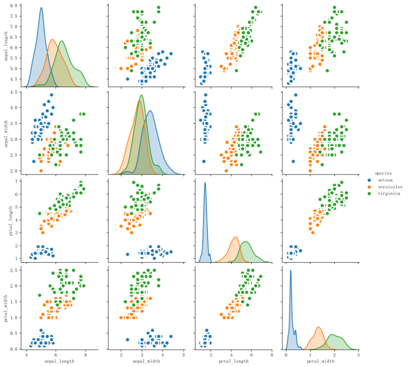

# 8.2 有监督学习的案例

## 8.2.1 分类问题：鸢尾花

鸢尾花数据集是机器学习中非常常用的一个数据集，在sklearn.dataset中自带，通过load_iris()函数导入。鸢尾花数据集是一个用于分类问题的经典数据集，包含三种不同种类的鸢尾花：山鸢尾、变色鸢尾和维吉尼亚鸢尾。数据集中的每个样本都有四个特征：花萼长度、花萼宽度、花瓣长度和花瓣宽度。这四个特征是用来预测鸢尾花卉属于哪一品种的重要依据。每一类各50条样本。我们可以看到它的统计分布图：



当我们在对数据集进行统计描述时，我们通常会关注数据的中心趋势、分散程度、分布形状和相关性等特征。我们可以对Iris数据集进行如下统计描述:

- 中心趋势：中心趋势描述了数据集中的观测值倾向于聚集的数值。对于Iris数据集中的量化特征（如萼片长度、萼片宽度、花瓣长度和花瓣宽度）都有一定的中心趋势，我们可以通过计算平均值来了解每个特征的中心位置。而对于分类特征（如花种），我们可以通过统计每个类别的出现频率来描述其中心趋势。在Iris数据集中，Setosa、Versicolour和Virginica三种花种各有50个样本，各占总样本数的1/3。

- 分散程度：Iris数据集中的每个特征都有一定的分散程度，可以通过计算其标准差来描述。分散程度反映了数据点之间的差异程度，标准差越大，数据点之间的差异就越大。例如，Setosa花种的花瓣长度的标准差为0.82厘米，Versicolour花种的花瓣长度的标准差为1.76厘米，Virginica花种的花瓣长度的标准差为2.06厘米。Setosa花种的花瓣长度标准差较小，表明大多数样本的花瓣长度接近平均值。相反，如果一个特征的标准差较大，如Virginica花种的花瓣长度，这可能表明样本之间存在较大的变异。

- 分布形状：分布形状描述了数据的分布模式，是对称、偏斜还是具有峰度。Iris数据集中的每个特征都有一定的分布形状，我们可以通过绘制直方图或密度图来观察数据的分布形状。分布形状反映了数据点的分布特征，对称的分布形状（如正态分布）通常表示数据的中心趋势与分散程度相符，非对称的分布形状则可能表示数据集中于某一范围或两侧。例如，如果Setosa花种的花瓣长度呈现右偏态分布，这可能意味着大多数样本的花瓣长度较短，只有少数样本的花瓣长度较长。这种分布形状可以帮助我们了解数据的集中趋势和异常值的可能性。

- 相关性：相关性描述了数据集中不同特征之间的关系，反映了特征之间的相关程度，相关性越高，特征之间的变化趋势越相似。通过计算相关系数，我们可以量化两个特征之间的线性关系强度。例如，如果花瓣长度和花瓣宽度之间的相关系数接近1，这表明这两个特征之间存在强烈的正相关关系，即花瓣长度较长的花往往花瓣宽度也较大。

进行机器学习第一步是导入数据并处理数据。通过下面的代码导入数据：

```python
import numpy as np

import pandas as pd

# 鸢尾花数据集，红酒数据集，乳腺癌数据集，房价预测数据集

from sklearn.datasets import load_iris,load_wine,load_breast_cancer,load_boston

# 回归重要指标

from sklearn.metrics import r2_score, mean_absolute_error, mean_squared_error

# 分类重要指标

from sklearn.metrics import accuracy_score, confusion_matrix, f1_score, precision_recall_curve, roc_auc_score

from sklearn.model_selection import train_test_split #训练集训练集分类器

import graphviz #画文字版决策树的模块

import pydotplus #画图片版决策树的模块

from IPython.display import ./src/image #画图片版决策树的模块

iris = load_iris()

print(iris.data)  # 数据

print(iris.target_names)  # 标签名

print(iris.target)  # 标签值

print(iris.feature_names)  # 特证名(列名)

iris_dataframe = pd.concat([pd.DataFrame(iris.data),pd.DataFrame(iris.target)],axis=1)

print(iris_dataframe)

Xtrain, Xtest, Ytrain,Ytest = train_test_split(iris.data,iris.target,test_size=0.3)
```

随后选择对应接口创建模型，输入数据通过fit方法进行训练，然后进行predict并评估指标即可。代码如下：

```python
from sklearn.linear_model import LogisticRegression,LinearRegression

from sklearn.neighbors import KNeighborsRegressor,KNeighborsClassifier

from sklearn.naive_bayes import GaussianNB

from sklearn.tree import DecisionTreeRegressor,DecisionTreeClassifier

from sklearn.ensemble import RandomForestRegressor,RandomForestClassifier

from sklearn.ensemble import ExtraTreesRegressor,ExtraTreesClassifier

from sklearn.ensemble import AdaBoostRegressor,AdaBoostClassifier

from sklearn.ensemble import GradientBoostingRegressor,GradientBoostingClassifier

clf = RandomForestClassifier()

clf.fit(Xtrain, Ytrain)

Ypredict=clf.predict(Xtest)

print(r2_score(Ypredict,Ytest))
```

其中，决策树、随机森林等具有树形结构的基学习器可以把树形结构打印出来并保存为PDF或png文件，代码如下：

```python
from sklearn import tree

tree_data = tree.export_graphviz(

    clf

    ,feature_names =iris.feature_names

    ,class_names = iris.feature_names#也可以自己起名

    ,filled = True #填充颜色

    ,rounded = True #决策树边框圆形/方形

)

graph1 = graphviz.Source(tree_data.replace('helvetica','Microsoft YaHei UI'), encoding='utf-8')

graph1.render('./iris_tree')
```

Python中想要评估模型效果的话scikit-learn也提供了不同问题的评估指标接口。

Scikit-learn（简称sklearn）是一个非常强大的机器学习库，提供了很多用于分类、回归和聚类的评估指标函数。以下是常用的一些函数：

分类问题常用函数：

- accuracy_score: 输入参数包括y_true（真实标签）和y_pred（预测标签）。输出参数为准确率，即预测正确的样本数占总样本数的比例。它的作用是评估分类器的准确率，通过比较真实标签和预测标签的一致性来计算准确率。
- confusion_matrix: 输入参数包括y_true（真实标签）和y_pred（预测标签）。输出参数为混淆矩阵，展示各类别之间的预测和实际分类情况。它的作用是评估分类器的性能，通过比较真实标签和预测标签的分类情况来生成混淆矩阵，以量化分类器的正确率、精度、召回率和F1分数等指标。
- classification_report: 输入参数包括y_true（真实标签）和y_pred（预测标签）。输出参数为分类报告，包括精确度、召回率和F1分数等分类性能指标。它的作用是提供详细的分类性能评估报告，通过比较真实标签和预测标签的分类情况来计算各类别的精确度、召回率和F1分数，以全面评估分类器的性能。
- roc_auc_score: 输入参数包括y_true（真实标签）和y_pred（预测概率）。输出参数为ROC曲线下的面积，用于评估二元分类器的性能。它的作用是通过计算ROC曲线下的面积来评估分类器的性能，ROC曲线展示了不同分类阈值下真正例率（TPR）和假正例率（FPR）的变化情况，AUC值越大表示分类器性能越好。
- average_precision_score: 输入参数包括y_true（真实标签）和y_score（预测分数）。输出参数为平均精度，用于评估二元分类器的性能。它的作用是计算在不同分类阈值下的平均精度，综合考虑了真正例率（TPR）和假正例率（FPR），以更全面地评估分类器的性能。
- brier_score_loss: 输入参数包括y_true（真实标签）和y_prob（预测概率）。输出参数为Brier分数，用于评估二元或多元分类器的性能。它的作用是计算Brier分数，通过比较真实标签和预测概率的差异来评估分类器的性能。Brier分数越小表示预测概率与真实标签越接近，分类器性能越好。
- f1_score: 输入参数包括y_true（真实标签）和y_pred（预测标签）。输出参数为F1分数，用于评估分类器的性能。它的作用是计算F1分数，综合考虑了精确度和召回率，以更全面地评估分类器的性能。F1分数越高表示分类器性能越好。

## 8.2.2 回归问题：波士顿房价

波士顿房价数据集是一个非常著名的数据集，广泛用于回归分析和机器学习的入门研究。该数据集最初由哈里森和鲁宾菲尔德在1978年发布，包含了波士顿地区房价的中位数与各种影响房价的因素。具体来说，这个数据集包含506个数据点，每个数据点有14个属性，这些属性包括城镇人均犯罪率、住宅用地比例、城镇非零售商用土地比例、查尔斯河虚拟变量、一氧化氮浓度、住宅平均房间数、1940年之前建成的自用房屋比例、到五个波士顿就业中心的加权距离、辐射性公路的接近指数、每10000美元的全值财产税率、城镇师生比例、城镇中黑人的比例、人口中地位较低人群的百分比以及自有住房的中位数价值（单位：千美元）。

房价预测的任务是基于这些数据集中的特征（即自变量），使用统计分析、机器学习或深度学习等方法，来构建一个预测模型，以预测波士顿地区房价的中位数（即因变量）。这是一个典型的回归任务，因为预测目标是一个连续的实数值。通过训练模型，我们可以发现哪些因素对房价有显著影响，并据此对未来房价进行预测。

导入数据、数据预处理的方法与前面一样，这里我不多赘述。那么可以使用的回归模型也列举在了上面，甚至训练方法都一模一样。

```python
from sklearn.datasets import load_boston  
from sklearn.model_selection import train_test_split  
from sklearn.linear_model import LinearRegression, Ridge, Lasso, ElasticNet  
from sklearn.tree import DecisionTreeRegressor  
from sklearn.ensemble import RandomForestRegressor, GradientBoostingRegressor  
from sklearn.svm import SVR  
from sklearn.metrics import mean_squared_error  
import numpy as np  
  
# 加载波士顿房价数据集  
boston = load_boston()  
X = boston.data  
y = boston.target  
  
# 划分训练集和测试集  
X_train, X_test, y_train, y_test = train_test_split(X, y, test_size=0.2, random_state=42)

# 线性回归  
lr = LinearRegression()  
lr.fit(X_train, y_train)  
y_pred_lr = lr.predict(X_test)  
print("线性回归的MSE:", mean_squared_error(y_test, y_pred_lr))
```

回归问题常用评估函数：

mean_squared_error: 输入参数包括y_true（真实值）和y_pred（预测值）。输出参数为均方误差，即预测值与真实值差的平方的平均值。它的作用是衡量回归模型的预测误差，通过比较预测值和真实值之间的差异来评估模型的性能。

- mean_absolute_error: 输入参数包括y_true（真实值）和y_pred（预测值）。输出参数为平均绝对误差，即预测值与真实值差的绝对值的平均值。它的作用是衡量回归模型的预测误差，通过比较预测值和真实值之间的差异来评估模型的性能。
- median_absolute_error: 输入参数包括y_true（真实值）和y_pred（预测值）。输出参数为中位数绝对误差，即预测值与真实值差的中位数绝对值。它的作用是衡量回归模型的预测误差，通过比较预测值和真实值之间的差异来评估模型的性能。
- r2_score: 输入参数包括y_true（真实值）和y_pred（预测值）。输出参数为R平方值，衡量回归模型的拟合优度。它的作用是通过计算R平方值来评估模型对数据的拟合程度，R平方值越接近于1表示模型拟合越好。
- explained_variance_score: 输入参数包括y_true（真实值）和y_pred（预测值）。输出参数为解释方差，衡量模型对数据的解释程度。它的作用是通过计算解释方差来评估模型对数据的解释能力，解释方差越接近于1表示模型对数据的解释程度越高。