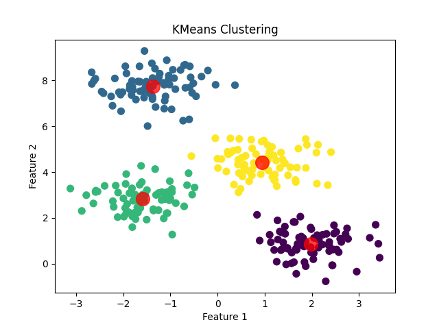
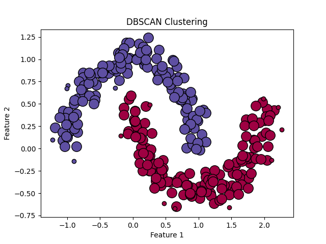
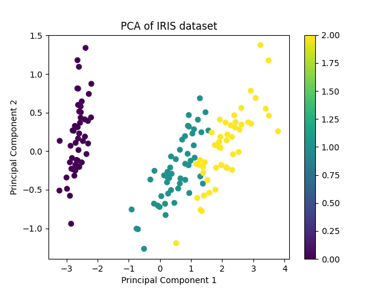
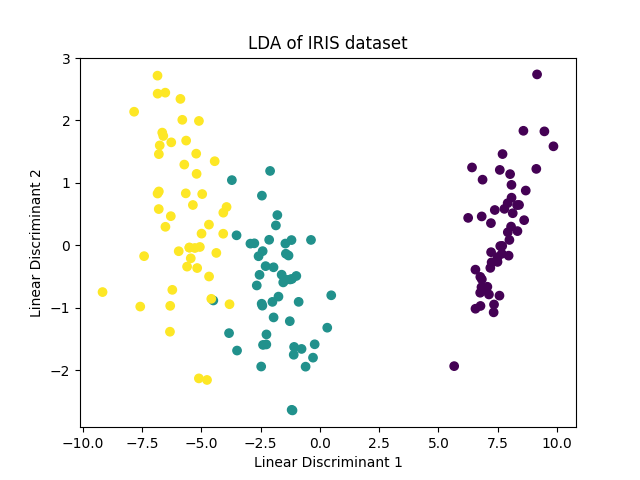

# 8.3 无监督学习的案例

## 8.3.1 聚类问题

以下是使用`sklearn`库进行KMeans聚类和DBSCAN聚类的代码demo。

### KMeans聚类

KMeans是一种基于距离的聚类算法，它将数据划分为预定义数量的簇（K），并使得簇内方差最小化。

```python
from sklearn.cluster import KMeans
from sklearn.datasets import make_blobs
import matplotlib.pyplot as plt

# 生成模拟数据
X, _ = make_blobs(n_samples=300, centers=4, cluster_std=0.60, random_state=0)

# 应用KMeans聚类
kmeans = KMeans(n_clusters=4)
kmeans.fit(X)
y_kmeans = kmeans.predict(X)

# 可视化结果
plt.scatter(X[:, 0], X[:, 1], c=y_kmeans, s=50, cmap='viridis')

centers = kmeans.cluster_centers_
plt.scatter(centers[:, 0], centers[:, 1], c='red', s=200, alpha=0.75);
plt.title("KMeans Clustering")
plt.xlabel("Feature 1")
plt.ylabel("Feature 2")
plt.show()
```



### DBSCAN聚类

DBSCAN是一种基于密度的聚类算法，它可以将具有足够高密度的区域划分为簇，并能在具有噪声的数据集中发现任意形状的簇。

```python
from sklearn.cluster import DBSCAN
from sklearn import metrics
from sklearn.datasets import make_moons
import matplotlib.pyplot as plt

# 生成模拟数据
X, _ = make_moons(n_samples=300, noise=0.1, random_state=42)

# 应用DBSCAN聚类
db = DBSCAN(eps=0.2, min_samples=5).fit(X)
core_samples_mask = np.zeros_like(db.labels_, dtype=bool)
core_samples_mask[db.core_sample_indices_] = True
labels = db.labels_

# 可视化结果
unique_labels = set(labels)
colors = [plt.cm.Spectral(each) for each in np.linspace(0, 1, len(unique_labels))]
for k, col in zip(unique_labels, colors):
    if k == -1:
        # Black used for noise.
        col = [0, 0, 0, 1]

    class_member_mask = (labels == k)

    xy = X[class_member_mask & core_samples_mask]
    plt.plot(xy[:, 0], xy[:, 1], 'o', markerfacecolor=tuple(col),
             markeredgecolor='k', markersize=14)

    xy = X[class_member_mask & ~core_samples_mask]
    plt.plot(xy[:, 0], xy[:, 1], 'o', markerfacecolor=tuple(col),
             markeredgecolor='k', markersize=6)

plt.title("DBSCAN Clustering")
plt.xlabel("Feature 1")
plt.ylabel("Feature 2")
plt.show()
```



注意：在DBSCAN的demo中，我使用了`numpy`库来生成颜色数组，但我没有在代码中显式导入它（你应该在代码顶部添加`import numpy as np`）。另外，由于DBSCAN可以识别噪声点（即不属于任何簇的点），因此我使用了`-1`标签来表示这些噪声点，并在可视化时将它们着色为黑色。

这些代码demo提供了KMeans和DBSCAN聚类的基本使用方法，并包括了数据生成、聚类模型的训练和结果的可视化。

## 8.3.2 降维问题

以下是使用`sklearn`库进行PCA（主成分分析）和LDA（线性判别分析）降维的代码案例。

### PCA降维

PCA是一种无监督的降维技术，它通过保留数据中的最大方差方向来减少数据的维度。

```python
from sklearn.decomposition import PCA
from sklearn.datasets import load_iris
import matplotlib.pyplot as plt

# 加载数据集
iris = load_iris()
X = iris.data
y = iris.target

# 应用PCA降维到2维
pca = PCA(n_components=2)
X_pca = pca.fit_transform(X)

# 可视化结果
plt.scatter(X_pca[:, 0], X_pca[:, 1], c=y, cmap='viridis')
plt.xlabel('Principal Component 1')
plt.ylabel('Principal Component 2')
plt.title('PCA of IRIS dataset')
plt.colorbar()
plt.show()
```



### LDA降维

LDA是一种有监督的降维技术，它旨在最大化类间方差并最小化类内方差，通常用于分类任务。

```python
from sklearn.discriminant_analysis import LinearDiscriminantAnalysis as LDA
from sklearn.datasets import load_iris
import matplotlib.pyplot as plt

# 加载数据集
iris = load_iris()
X = iris.data
y = iris.target

# 应用LDA降维到2维
lda = LDA(n_components=2)
X_lda = lda.fit_transform(X, y)

# 可视化结果
plt.scatter(X_lda[:, 0], X_lda[:, 1], c=y, cmap='viridis')
plt.xlabel('Linear Discriminant 1')
plt.ylabel('Linear Discriminant 2')
plt.title('LDA of IRIS dataset')
plt.colorbar()
plt.show()
```



在这两个例子中，我们首先加载了Iris数据集，这是一个常用于分类任务的多变量数据集。然后，我们分别应用了PCA和LDA算法，将数据的维度从4维降到了2维，以便进行可视化。在可视化部分，我们使用了`matplotlib`库来绘制散点图，其中不同的颜色代表不同的类别。

请注意，由于LDA是一种有监督学习方法，我们在调用`fit_transform`时需要同时提供特征矩阵`X`和标签`y`。而PCA是无监督的，因此在调用`fit_transform`时只需要提供特征矩阵`X`。